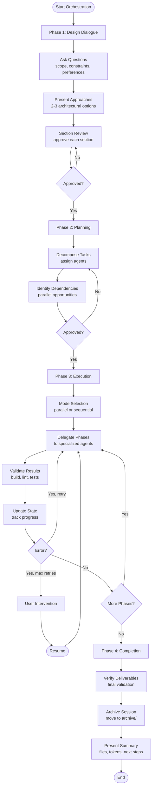
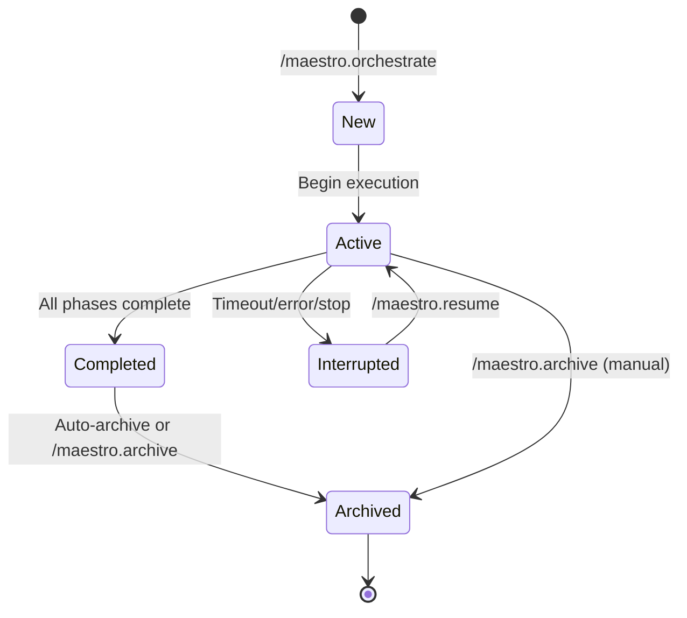
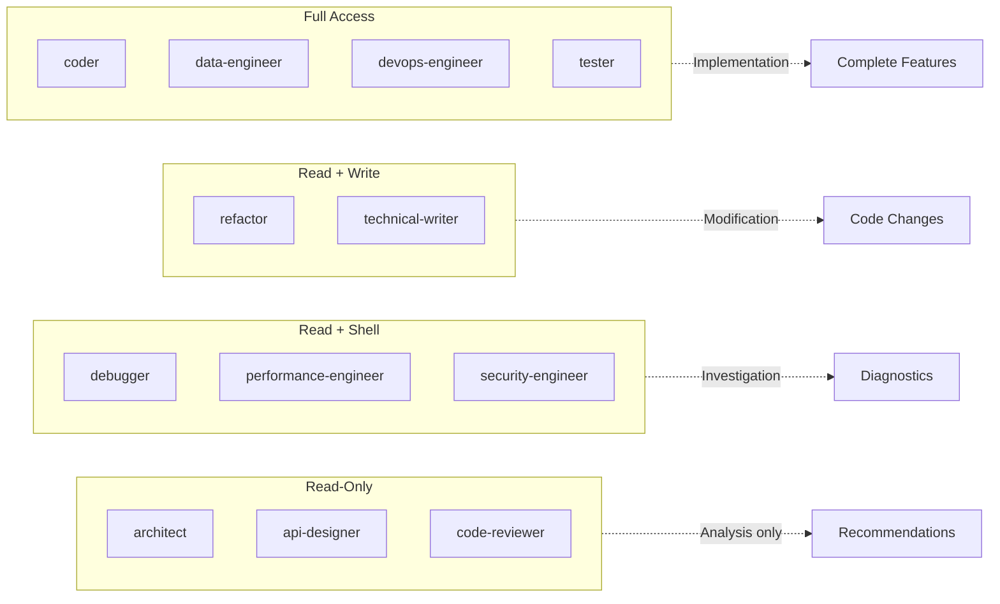

# Maestro Usage Guide

Comprehensive guide to installing, configuring, and using the Maestro multi-agent orchestration extension for Gemini CLI.

## Table of Contents

1. [Prerequisites](#prerequisites)
2. [Installation](#installation)
3. [Quick Start](#quick-start)
4. [Command Reference](#command-reference)
5. [Workflow Guide](#workflow-guide)
6. [Working with Sessions](#working-with-sessions)
7. [Specialized Commands](#specialized-commands)
8. [Configuration](#configuration)
9. [Tips and Best Practices](#tips-and-best-practices)
10. [Troubleshooting](#troubleshooting)

## Prerequisites

### Required Software

1. **Gemini CLI**: Maestro is a Gemini CLI extension. Install Gemini CLI from [geminicli.com](https://geminicli.com) before proceeding.

2. **Node.js**: Required for version management scripts. Install Node.js 16 or later from [nodejs.org](https://nodejs.org).

### Enable Experimental Subagents

Maestro requires Gemini CLI's experimental subagent system. Enable it in your Gemini CLI settings file:

**Location**:
- macOS/Linux: `~/.gemini/settings.json`
- Windows: `%USERPROFILE%\.gemini\settings.json`

**Configuration**:
```json
{
  "experimental": {
    "enableAgents": true
  }
}
```

If the file does not exist, create it with the content above. If it exists, add the `experimental` section to your existing configuration.

**Important**: Subagents operate in autonomous mode — they execute tools (shell commands, file writes, file deletions) without individual confirmation for each step. Review the [Gemini CLI subagents documentation](https://geminicli.com/docs/core/subagents/) for full details.

Maestro will check for subagent support on startup and offer to enable it if missing.

## Installation

### From Git Repository

Install directly from GitHub:

```bash
gemini extensions install https://github.com/josstei/maestro-gemini
```

This downloads the extension and links it automatically.

### Local Development

For local development or to contribute:

```bash
git clone https://github.com/josstei/maestro-gemini
cd maestro-gemini
gemini extensions link .
```

The `link` command creates a symlink from your Gemini CLI extensions directory to the current directory. Run this from the cloned repository root.

### Verify Installation

Restart Gemini CLI after installation. Verify the extension loaded successfully:

```bash
gemini extensions list
```

You should see `maestro` in the list of active extensions.

## Quick Start

This walkthrough demonstrates a complete orchestration from start to finish.

### 1. Start Orchestration

```
/maestro.orchestrate Build a REST API for a task management system with user authentication
```

### 2. Design Dialogue

Maestro will engage you in a structured conversation:

**Question Example**:
```
Authentication Strategy: Which authentication approach would you prefer?

Options:
1. JWT-based authentication (Recommended) — Stateless, scalable, industry standard
2. Session-based authentication — Server-managed, easier revocation
3. OAuth 2.0 with external provider — Leverage Google/GitHub for auth

My recommendation: JWT-based authentication because it scales horizontally without session storage and integrates well with modern frontend frameworks.
```

Maestro asks one question at a time, covering:
- Problem scope and boundaries
- Technical constraints
- Technology preferences
- Quality requirements (performance, security, scalability)
- Deployment context

### 3. Architectural Approaches

After gathering requirements, Maestro presents 2-3 architectural approaches:

```
Approach 1: Monolithic REST API (Recommended)

Summary: Single Node.js/Express server with layered architecture (routes → services → data access). PostgreSQL for persistence. JWT authentication middleware.

Pros:
- Simple deployment and debugging
- Low operational complexity
- Fast development velocity for small teams
- All code in one repository

Cons:
- Scales vertically only (initially)
- Tight coupling between components
- Harder to adopt microservices later

Best When: Team is small, traffic is moderate, time-to-market is critical

Risk Level: Low
```

Choose your preferred approach. Maestro will accept your choice without pushback.

### 4. Design Review

Maestro presents the design document section by section (200-300 words each):

1. Problem Statement & Requirements
2. Selected Approach & Architecture
3. Component Specifications & Data Flow
4. Agent Team Composition & Phase Plan
5. Risk Assessment & Mitigation
6. Success Criteria

After each section, you'll be asked to approve or request changes. Once all sections are approved, Maestro writes the design document to `.gemini/plans/YYYY-MM-DD-task-management-api-design.md`.

### 5. Implementation Planning

Maestro generates a detailed implementation plan with:
- Phases broken down by task domain
- Agent assignments (coder, tester, devops-engineer, etc.)
- Dependency graph showing which phases must run sequentially
- Parallel execution opportunities
- Validation criteria per phase

You'll review and approve the plan. Once approved, Maestro writes it to `.gemini/plans/YYYY-MM-DD-task-management-api-impl-plan.md` and creates a session state file at `.gemini/state/active-session.md`.

### 6. Execution

Maestro asks which execution mode to use:

**Option 1: Parallel Dispatch (faster)**
- Independent phases run as concurrent `gemini` CLI processes
- Agents operate in autonomous mode (`--yolo`) — all tool calls are auto-approved
- You review results after each batch completes
- Best for well-defined tasks with clear file ownership

**Option 2: Sequential Delegation (safer)**
- Each phase executes one at a time
- Standard tool approval rules apply
- You can intervene between phases
- Best for exploratory tasks or security-sensitive work

Choose your mode. Maestro will execute the plan phase by phase, delegating work to specialized agents:

```
Phase 1: Database Schema Design
  Agent: data-engineer
  Status: In Progress...

Phase 2: Authentication Middleware
  Agent: coder
  Status: In Progress...

Phase 3: REST API Endpoints
  Agent: api-designer → coder
  Status: Pending (blocked by Phase 2)
```

After each phase, Maestro updates the session state with files changed, validation results, and token usage.

### 7. Completion

When all phases are complete, Maestro presents a final summary:

```
Orchestration Complete: 2026-02-15-task-management-api

Delivered:
- PostgreSQL schema with users, tasks, and sessions tables
- JWT authentication middleware with token generation and validation
- REST API with 12 endpoints (CRUD for users and tasks)
- Integration tests with 85% coverage
- Dockerfile and docker-compose.yml for local development

Files Changed:
- Created: 24 files
- Modified: 3 files
- Deleted: 0 files

Token Usage:
- Total: 125,000 tokens (80,000 input, 45,000 output)
- By Agent: coder (45k), tester (32k), data-engineer (18k)

Deviations from Plan: None

Recommended Next Steps:
- Run `docker-compose up` to start the development environment
- Review API documentation in docs/api.md
- Configure environment variables in .env (see .env.example)
```

The session is automatically archived to `.gemini/state/archive/2026-02-15-task-management-api.md`.

## Command Reference

### /maestro.orchestrate

Start a full Maestro orchestration for a complex engineering task.

**Syntax**:
```
/maestro.orchestrate <task description>
```

**Arguments**:
- `<task description>`: Natural language description of what you want to build or change

**Behavior**:
1. Checks for existing active sessions in `.gemini/state/`
2. If an active session exists, offers to resume or archive it
3. Begins the four-phase orchestration workflow:
   - **Phase 1**: Design Dialogue — structured requirements gathering
   - **Phase 2**: Team Assembly & Planning — agent selection and task decomposition
   - **Phase 3**: Execution — delegated implementation with progress tracking
   - **Phase 4**: Completion — final review and archival

**When to Use**:
- Complex tasks requiring multiple specialized agents
- Projects needing architectural design before implementation
- When you want a structured approach with clear checkpoints

**Example**:
```
/maestro.orchestrate Build a REST API for a task management system with user authentication
```

**Expected Output**:
- Interactive design dialogue with multiple-choice questions
- Architectural approach proposals
- Generated design document in `.gemini/plans/`
- Implementation plan with phase dependencies
- Session state tracking in `.gemini/state/active-session.md`
- Phase-by-phase execution with progress updates

### /maestro.resume

Resume an interrupted orchestration session.

**Syntax**:
```
/maestro.resume
```

**Arguments**: None

**Behavior**:
1. Reads `.gemini/state/active-session.md`
2. Parses session metadata and phase statuses
3. Presents a status summary:
   - Session ID and creation timestamp
   - Phase-by-phase status (completed, in_progress, failed, pending)
   - Unresolved errors from previous execution
   - What will happen next
4. If errors exist, presents them and asks for guidance before retrying
5. Continues execution from the last active/pending phase

**When to Use**:
- Orchestration was interrupted (timeout, manual stop, error)
- You want to check session state before continuing
- Previous execution failed and you've manually fixed the issue

**Example**:
```
/maestro.resume
```

**Expected Output**:
```
Resuming Session: 2026-02-15-task-management-api
Created: 2026-02-15T10:30:00Z

Phase Status:
✓ Phase 1: Database Schema Design (completed)
✓ Phase 2: Authentication Middleware (completed)
✗ Phase 3: REST API Endpoints (failed)
□ Phase 4: Integration Tests (pending)

Unresolved Errors:
Phase 3 (coder):
  Type: validation
  Message: ESLint errors in src/routes/tasks.js - unused variable 'userId'

I'll retry Phase 3 now. Continue?
```

### /maestro.execute

Execute an existing implementation plan, skipping design and planning phases.

**Syntax**:
```
/maestro.execute <path-to-implementation-plan>
```

**Arguments**:
- `<path-to-implementation-plan>`: Path to an implementation plan file (e.g., `.gemini/plans/2026-02-15-api-refactor-impl-plan.md`)
- If omitted, Maestro checks `.gemini/plans/` for the most recent plan

**Behavior**:
1. Reads the specified implementation plan
2. Creates a session state file for tracking
3. Presents an execution summary:
   - Total phases and agent assignments
   - Parallel execution opportunities
   - Estimated effort
4. Asks for confirmation before beginning
5. Executes phases according to the plan
6. Archives the session on completion

**When to Use**:
- You have a pre-written implementation plan
- Skipping design dialogue to save time
- Re-executing a plan from a previous session

**Example**:
```
/maestro.execute .gemini/plans/2026-02-15-api-refactor-impl-plan.md
```

**Expected Output**:
```
Implementation Plan: 2026-02-15-api-refactor-impl-plan.md

Summary:
- 8 phases (4 parallelizable)
- Agents: coder (4 phases), refactor (2 phases), tester (2 phases)
- Estimated: 60-90 minutes

Execution Mode:
Which mode would you like to use? (parallel/sequential)
```

### /maestro.review

Run a standalone code review on staged changes, last commit, or specified paths.

**Syntax**:
```
/maestro.review [file paths or glob patterns]
```

**Arguments**:
- `[file paths or glob patterns]`: Optional. Specific files or patterns to review (e.g., `src/api/*.js`)
- If omitted, Maestro auto-detects scope: staged changes → last commit diff

**Behavior**:
1. Auto-detects review scope (priority order):
   - User-specified paths (if provided)
   - Staged changes (`git diff --staged`)
   - Last commit diff (`git diff HEAD~1`)
2. Confirms detected scope with you
3. Delegates to the `code-reviewer` agent
4. Presents findings classified by severity:
   - **Critical**: Security vulnerabilities, data loss risks
   - **Major**: Logic errors, performance issues, broken patterns
   - **Minor**: Code quality issues, style inconsistencies
   - **Suggestion**: Optimization opportunities, refactoring ideas
5. Every finding references a specific file and line number

**When to Use**:
- Before committing changes
- Reviewing a pull request
- Auditing specific files for quality issues
- Getting a second opinion on implementation

**Example**:
```
/maestro.review src/api/tasks.js src/api/users.js
```

**Expected Output**:
```
Code Review Report

Scope: src/api/tasks.js, src/api/users.js
Files Reviewed: 2
Lines Reviewed: 450

Findings:

CRITICAL (1):
- src/api/tasks.js:45 — SQL injection vulnerability in raw query
  Use parameterized queries instead of string concatenation

MAJOR (2):
- src/api/users.js:78 — Password stored in plain text
  Hash passwords with bcrypt before storing
- src/api/tasks.js:120 — Missing error handling on database operations
  Wrap in try-catch and return appropriate HTTP status

MINOR (3):
- src/api/users.js:23 — Inconsistent naming (snake_case vs camelCase)
- src/api/tasks.js:90 — Magic number 100 should be a named constant
- src/api/users.js:150 — Unused import 'lodash'

SUGGESTIONS (1):
- src/api/tasks.js:60-80 — Consider extracting validation logic to middleware
```

### /maestro.status

Display the current orchestration session status.

**Syntax**:
```
/maestro.status
```

**Arguments**: None

**Behavior**:
1. Reads `.gemini/state/active-session.md`
2. Presents a concise status summary:
   - Session ID and creation timestamp
   - Overall status (in_progress, completed, failed)
   - Phase breakdown with status indicators
   - File manifest (files created, modified, deleted)
   - Token usage (total and top agents)
   - Unresolved errors
3. Read-only — does not modify state or continue execution

**When to Use**:
- Checking orchestration progress
- Understanding what has been completed
- Reviewing token usage before proceeding
- Identifying errors without resuming execution

**Example**:
```
/maestro.status
```

**Expected Output**:
```
Orchestration Session Status

Session ID: 2026-02-15-task-management-api
Created: 2026-02-15T10:30:00Z
Updated: 2026-02-15T11:45:00Z
Status: In Progress

Phase Status:
✓ Phase 1: Database Schema Design (completed at 10:45)
✓ Phase 2: Authentication Middleware (completed at 11:20)
○ Phase 3: REST API Endpoints (in progress since 11:25)
□ Phase 4: Integration Tests (pending)
□ Phase 5: Documentation (pending)

Files Changed:
- Created: 12 files
- Modified: 2 files
- Deleted: 0 files

Token Usage:
- Total: 45,000 tokens (28,000 input, 17,000 output)
- By Agent: coder (22k), data-engineer (15k), tester (8k)

Errors: None
```

### /maestro.archive

Archive the current active orchestration session.

**Syntax**:
```
/maestro.archive
```

**Arguments**: None

**Behavior**:
1. Checks for an active session at `.gemini/state/active-session.md`
2. If no active session exists, informs you there is nothing to archive
3. If an active session exists:
   - Presents a summary of what will be archived
   - Asks for confirmation (session may have incomplete phases)
   - Moves design document to `.gemini/plans/archive/`
   - Moves implementation plan to `.gemini/plans/archive/`
   - Updates session status to `completed`
   - Moves session state to `.gemini/state/archive/<session-id>.md`
4. Verifies archival was successful (no `active-session.md` remains)
5. Confirms to you with a summary of archived files

**When to Use**:
- Manually archiving a completed session (when `MAESTRO_AUTO_ARCHIVE` is `false`)
- Cleaning up an incomplete session you no longer need
- Before starting a new orchestration (required if active session exists)

**Example**:
```
/maestro.archive
```

**Expected Output**:
```
Archive Confirmation

Active Session: 2026-02-15-task-management-api
Status: In Progress (3 of 5 phases completed)

This session will be archived with incomplete phases. Continue?

[After confirmation]

Archived Successfully:
- Design document → .gemini/plans/archive/2026-02-15-task-management-api-design.md
- Implementation plan → .gemini/plans/archive/2026-02-15-task-management-api-impl-plan.md
- Session state → .gemini/state/archive/2026-02-15-task-management-api.md

No active session remains.
```

### /maestro.debug

Focused debugging session to investigate and diagnose an issue.

**Syntax**:
```
/maestro.debug <issue description>
```

**Arguments**:
- `<issue description>`: Natural language description of the problem you're experiencing

**Behavior**:
1. Delegates to the `debugger` agent with your issue description
2. The debugger follows a systematic methodology:
   - **Reproduce**: Understand expected vs actual behavior
   - **Hypothesize**: Form 2-3 likely root causes
   - **Investigate**: Trace execution flow, examine logs, inspect state
   - **Isolate**: Narrow to specific code path and condition
   - **Verify**: Confirm root cause explains all symptoms
3. Presents findings including:
   - Root cause summary
   - Evidence (specific files, lines, log entries)
   - Execution trace from trigger to failure
   - Recommended fix with specific code location
   - Regression prevention suggestion

**When to Use**:
- Investigating a bug or unexpected behavior
- Understanding why a test is failing
- Tracing the source of an error message
- Getting help with a confusing stack trace

**Example**:
```
/maestro.debug User login returns 500 error when password contains special characters
```

**Expected Output**:
```
Debug Report: User Login 500 Error

Root Cause:
Password validation regex in src/auth/validate.js:34 does not escape special characters, causing regex syntax errors when input contains characters like $ or ^.

Evidence:
- src/auth/validate.js:34 — Regex pattern: /^[A-Za-z0-9!@#$%^&*()]+$/
- Error log: "Invalid regular expression: Unmatched ')'"
- Test case: Password "test^pass)" triggers the error

Execution Trace:
1. POST /api/login with password "test^pass)"
2. src/routes/auth.js:45 → validatePassword(password)
3. src/auth/validate.js:34 → new RegExp(pattern) throws SyntaxError
4. Error propagates to Express error handler
5. Returns 500 Internal Server Error

Recommended Fix:
File: src/auth/validate.js
Line: 34
Change:
  const pattern = /^[A-Za-z0-9!@#$%^&*()]+$/;
To:
  const pattern = /^[A-Za-z0-9!@#$%^&*()]+$/;

Or use character class escaping:
  const pattern = /^[\w!@#$%^&*()]+$/;

Regression Prevention:
Add test case in test/auth/validate.test.js:
  it('validates password with special characters', () => {
    expect(validatePassword('test^pass)')).toBe(true);
  });
```

### /maestro.security-audit

Run a security assessment on the specified scope.

**Syntax**:
```
/maestro.security-audit <scope>
```

**Arguments**:
- `<scope>`: Files, directories, or components to audit (e.g., `src/auth`, `src/api/*.js`, `entire codebase`)

**Behavior**:
1. Delegates to the `security-engineer` agent with the specified scope
2. The security engineer performs:
   - OWASP Top 10 vulnerability review
   - Data flow analysis from input to output
   - Authentication and authorization assessment
   - Secrets management and credential handling audit
   - Dependency vulnerability scan
   - Threat modeling using STRIDE methodology
3. Presents findings with:
   - Severity (aligned with CVSS: Critical, High, Medium, Low)
   - Location (file and line)
   - Description and proof of concept
   - Remediation recommendation
   - Overall security posture assessment

**When to Use**:
- Before deploying to production
- After adding authentication or payment processing
- When handling sensitive user data
- Auditing third-party dependencies
- Compliance requirements (SOC 2, GDPR, HIPAA)

**Example**:
```
/maestro.security-audit src/auth src/api
```

**Expected Output**:
```
Security Audit Report

Scope: src/auth, src/api
Files Reviewed: 18
Lines Reviewed: 2,450

Findings:

CRITICAL (2):
- src/auth/jwt.js:23 — Hardcoded JWT secret in source code
  Severity: Critical (CVSS 9.1)
  Threat: Secret exposure allows token forgery
  Remediation: Move secret to environment variable, rotate immediately

- src/api/users.js:67 — SQL injection vulnerability
  Severity: Critical (CVSS 9.8)
  Threat: Attacker can read/modify database
  PoC: POST /api/users with username="admin' OR '1'='1"
  Remediation: Use parameterized queries

HIGH (3):
- src/auth/password.js:45 — Weak password hashing (MD5)
  Use bcrypt with cost factor 12+

- src/api/tasks.js:120 — Missing authorization check
  Users can access other users' tasks by guessing IDs
  Implement ownership validation

- src/auth/session.js:90 — Session tokens not invalidated on logout
  Implement token blacklist or short TTL

MEDIUM (5):
[Additional findings...]

Overall Security Posture: High Risk
Critical issues must be addressed before production deployment.
```

### /maestro.perf-check

Run a performance analysis on the specified scope.

**Syntax**:
```
/maestro.perf-check <scope>
```

**Arguments**:
- `<scope>`: Files, directories, or components to analyze (e.g., `src/api/tasks.js`, `database queries`, `entire application`)

**Behavior**:
1. Delegates to the `performance-engineer` agent with the specified scope
2. The performance engineer follows a systematic methodology:
   - **Baseline**: Establish current performance metrics
   - **Profile**: Identify hotspots using appropriate tools
   - **Analyze**: Determine root cause of bottlenecks
   - **Recommend**: Propose optimizations ranked by impact-to-effort ratio
3. Presents findings with:
   - Performance baseline and key metrics
   - Bottleneck identification with evidence
   - Optimization recommendations ranked by impact
   - Expected improvement estimates
   - Measurement plan for validating improvements

**When to Use**:
- Application is slow or unresponsive
- Preparing for increased traffic
- Optimizing database queries
- Reducing resource usage (CPU, memory, bandwidth)
- Meeting performance SLAs

**Example**:
```
/maestro.perf-check src/api/tasks.js
```

**Expected Output**:
```
Performance Analysis Report

Scope: src/api/tasks.js
Analysis Type: Code Review + Query Profiling

Baseline Metrics:
- Average response time: 850ms (target: <200ms)
- P95 latency: 1,200ms
- Throughput: 50 req/sec
- Database queries per request: 12

Bottlenecks Identified:

1. N+1 Query Problem (HIGH IMPACT)
   Location: src/api/tasks.js:78-92
   Issue: Fetches task assignees in a loop (1 query per task)
   Current: 12 queries for 10 tasks
   Evidence: 720ms spent on database I/O

2. Missing Index (MEDIUM IMPACT)
   Location: Database table 'tasks' on column 'assignee_id'
   Issue: Full table scan on every query
   Evidence: EXPLAIN shows 50,000 rows scanned for 10 results

3. Unoptimized JSON Serialization (LOW IMPACT)
   Location: src/api/tasks.js:120
   Issue: Serializing entire task object including large description field
   Evidence: 80ms serialization time per request

Optimization Recommendations (ranked by impact-to-effort):

1. Fix N+1 Query (HIGH IMPACT, LOW EFFORT)
   Change: Use JOIN or IN clause to fetch assignees in single query
   Expected Improvement: 700ms reduction (850ms → 150ms)
   Effort: 30 minutes

2. Add Database Index (HIGH IMPACT, LOW EFFORT)
   Change: CREATE INDEX idx_tasks_assignee ON tasks(assignee_id)
   Expected Improvement: 100ms reduction (150ms → 50ms)
   Effort: 5 minutes

3. Selective Serialization (LOW IMPACT, MEDIUM EFFORT)
   Change: Serialize only required fields
   Expected Improvement: 50ms reduction (50ms → <10ms)
   Effort: 2 hours (requires API contract review)

Measurement Plan:
1. Add APM instrumentation (New Relic, DataDog)
2. Track P50, P95, P99 latencies
3. Monitor query counts and execution times
4. Load test with 500 concurrent users
```

## Workflow Guide

This section walks through the Design → Plan → Execute → Complete lifecycle from a user perspective.



### Phase 1: Design Dialogue

**Goal**: Converge on an approved architectural design through structured conversation.

**What Happens**:

1. **Structured Questions**: Maestro asks one question at a time, covering:
   - Problem scope and boundaries
   - Technical constraints (existing stack, compatibility requirements)
   - Technology preferences (languages, frameworks, databases)
   - Quality requirements (performance, security, scalability)
   - Deployment context (cloud provider, CI/CD, monitoring)

2. **Question Format**: Questions are presented as multiple choice with 2-4 options. Maestro leads with a recommended option and explains why.

3. **Architectural Approaches**: After gathering requirements, Maestro presents 2-3 architectural approaches. Each includes:
   - Summary and architecture diagram
   - Pros and cons
   - Best-fit scenarios
   - Risk level

4. **Section-by-Section Review**: Once you choose an approach, Maestro presents the design document in sections (200-300 words each). You approve or request changes for each section before proceeding.

5. **Design Document**: After all sections are approved, Maestro writes the design document to `.gemini/plans/YYYY-MM-DD-<topic>-design.md`.

**Your Actions**:
- Answer questions thoughtfully — the more context you provide, the better the design
- Choose the architectural approach that best fits your needs (not necessarily the recommended one)
- Review each section carefully — changes are harder to make later
- Give explicit final approval before proceeding to Phase 2

### Phase 2: Team Assembly & Planning

**Goal**: Generate a detailed implementation plan with agent assignments, dependencies, and validation criteria.

**What Happens**:

1. **Task Decomposition**: Maestro analyzes the design and breaks it into implementation phases.

2. **Agent Assignment**: Each phase is assigned to one or more specialized agents based on task domain:
   - `architect`: System design, component specifications
   - `coder`: Feature implementation
   - `data-engineer`: Database schema, queries
   - `tester`: Unit/integration/E2E tests
   - `devops-engineer`: CI/CD, Docker, infrastructure
   - `security-engineer`: Authentication, authorization, vulnerability assessment
   - `technical-writer`: Documentation, API specs

3. **Dependency Mapping**: Maestro identifies which phases must run sequentially (blocked by dependencies) and which can run in parallel.

4. **Implementation Plan**: Maestro generates a detailed plan with:
   - Phase-by-phase breakdown
   - Agent assignments
   - Dependency graph
   - Parallel execution opportunities
   - Validation criteria

5. **Session Creation**: After you approve the plan, Maestro writes it to `.gemini/plans/YYYY-MM-DD-<topic>-impl-plan.md` and creates a session state file at `.gemini/state/active-session.md`.

**Your Actions**:
- Review the implementation plan for completeness
- Verify agent assignments make sense for each task
- Check that validation criteria are clear and measurable
- Approve the plan to proceed to Phase 3

### Phase 3: Execution

**Goal**: Execute the implementation plan phase by phase, delegating to specialized agents.

**What Happens**:

1. **Execution Mode Selection**: Maestro asks which execution mode to use:
   - **Parallel Dispatch**: Independent phases run concurrently as separate `gemini` CLI processes. Faster but fully autonomous (agents auto-approve all tool calls).
   - **Sequential Delegation**: Each phase executes one at a time. Safer with tool approval and intervention opportunities.

2. **Phase Execution**: Maestro delegates work to agents according to the plan:
   - Sequential phases execute in dependency order
   - Parallel phases execute concurrently (if parallel mode selected)
   - Each agent receives a delegation prompt with full context

3. **Progress Tracking**: After each phase:
   - Maestro updates session state with files changed
   - Runs validation (build, lint, tests) if applicable
   - Records token usage
   - Logs downstream context for dependent phases

4. **Error Handling**: If a phase fails:
   - Maestro records the error in session state
   - Retries automatically (up to `MAESTRO_MAX_RETRIES`, default: 2)
   - Escalates to you if retries exhausted

5. **State Persistence**: Session state is continuously updated in `.gemini/state/active-session.md`. You can check status with `/maestro.status` or resume with `/maestro.resume` if interrupted.

**Your Actions**:
- Choose execution mode based on task complexity and trust level
- Monitor progress (Maestro provides updates after each phase)
- Intervene if errors occur (manual fix → `/maestro.resume`)
- Review agent output if needed (session state contains full logs)

### Phase 4: Completion

**Goal**: Final review, validation, and archival.

**What Happens**:

1. **Final Review**: Maestro verifies all phases are completed and deliverables are accounted for.

2. **Validation**: Maestro runs final validation (build, lint, tests) across all deliverables.

3. **Archival**: If `MAESTRO_AUTO_ARCHIVE` is `true` (default), Maestro automatically archives the session:
   - Design document → `.gemini/plans/archive/`
   - Implementation plan → `.gemini/plans/archive/`
   - Session state → `.gemini/state/archive/<session-id>.md`

4. **Summary**: Maestro presents a final summary with:
   - What was delivered
   - Files changed (created, modified, deleted)
   - Token usage by agent
   - Deviations from plan (if any)
   - Recommended next steps

**Your Actions**:
- Review the summary
- Test the deliverables
- Follow recommended next steps (e.g., run tests, configure environment variables)

## Working with Sessions



### Session State Files

Maestro tracks all orchestration progress in `.gemini/state/active-session.md` using YAML frontmatter + Markdown body.

**Location**:
```
<your-project>/
└── .gemini/
    └── state/
        ├── active-session.md       # Current orchestration
        └── archive/                # Completed sessions
            └── 2026-02-15-task-management-api.md
```

**Structure**:
```yaml
---
session_id: "2026-02-15-task-management-api"
created: "2026-02-15T10:30:00Z"
updated: "2026-02-15T11:45:00Z"
status: "in_progress"
design_document: ".gemini/plans/2026-02-15-task-management-api-design.md"
implementation_plan: ".gemini/plans/2026-02-15-task-management-api-impl-plan.md"
current_phase: 3
total_phases: 5

token_usage:
  total_input: 45000
  total_output: 17000
  by_agent:
    coder: { input: 22000, output: 8000 }
    data-engineer: { input: 15000, output: 6000 }

phases:
  - id: 1
    name: "Database Schema Design"
    status: "completed"
    agents: ["data-engineer"]
    started: "2026-02-15T10:35:00Z"
    completed: "2026-02-15T10:45:00Z"
    files_created: ["src/db/schema.sql"]
    errors: []
  - id: 2
    name: "Authentication Middleware"
    status: "completed"
    agents: ["coder"]
    ...
  - id: 3
    name: "REST API Endpoints"
    status: "in_progress"
    agents: ["coder"]
    started: "2026-02-15T11:25:00Z"
    ...
---

# Task Management API Orchestration Log

## Phase 1: Database Schema Design ✓
...
```

### Checking Session Status

Use `/maestro.status` to check orchestration progress without continuing execution:

```
/maestro.status
```

This displays:
- Session ID and timestamps
- Overall status
- Phase-by-phase status with indicators
- File manifest (created, modified, deleted)
- Token usage
- Unresolved errors

### Resuming Interrupted Sessions

If orchestration is interrupted (timeout, manual stop, error), resume with:

```
/maestro.resume
```

Maestro will:
1. Read the session state
2. Present a summary of what's completed and what's pending
3. If errors exist, present them and ask for guidance
4. Continue from the last active/pending phase

**Common Resume Scenarios**:

1. **Timeout**: An agent took too long and was terminated
   - Review the timeout error in session state
   - Adjust `MAESTRO_AGENT_TIMEOUT` if needed
   - `/maestro.resume` to retry

2. **Validation Failure**: Build or tests failed after a phase
   - Review the error logs
   - Manually fix the issue
   - `/maestro.resume` to retry validation

3. **Manual Stop**: You stopped Gemini CLI mid-orchestration
   - `/maestro.resume` picks up where you left off

### Archiving Sessions

Sessions are automatically archived on completion if `MAESTRO_AUTO_ARCHIVE` is `true` (default).

To manually archive a session:

```
/maestro.archive
```

This moves:
- Design document → `.gemini/plans/archive/`
- Implementation plan → `.gemini/plans/archive/`
- Session state → `.gemini/state/archive/<session-id>.md`

**When to Manually Archive**:
- You've set `MAESTRO_AUTO_ARCHIVE` to `false`
- Orchestration is incomplete but you want to start fresh
- Cleaning up before starting a new orchestration (required if active session exists)

### Multiple Sessions

Maestro enforces a single active session at a time. If you start `/maestro.orchestrate` with an existing active session, Maestro will:
1. Detect the active session
2. Present its status
3. Offer to resume or archive it
4. Wait for your decision before proceeding

This prevents conflicting orchestrations and accidental overwrites.

## Specialized Commands

These commands provide direct access to specific agents without full orchestration.

### Code Review (/maestro.review)

**Use Case**: Get a code quality assessment before committing changes.

**Best Practices**:
- Run on staged changes before committing: `/maestro.review`
- Review specific files: `/maestro.review src/api/*.js`
- Use after refactoring to catch regressions

**Severity Levels**:
- **Critical**: Security vulnerabilities, data loss risks — fix immediately
- **Major**: Logic errors, broken patterns — fix before merging
- **Minor**: Code quality issues — fix when convenient
- **Suggestion**: Optimization opportunities — optional

**Example Workflow**:
```bash
git add src/api/tasks.js src/api/users.js
/maestro.review

# Review findings
# Fix critical and major issues
git add .
git commit -m "Add task and user API endpoints"
```

### Debugging (/maestro.debug)

**Use Case**: Investigate and diagnose a bug or unexpected behavior.

**Best Practices**:
- Provide specific symptoms: `/maestro.debug Login returns 500 when password contains special characters`
- Include error messages if available
- Mention steps to reproduce
- The debugger agent has shell access and can run tests, examine logs, and trace execution

**Example Workflow**:
```bash
/maestro.debug User authentication fails with "Invalid token" error after upgrading to v2.0

# Debugger investigates:
# 1. Examines auth middleware
# 2. Checks JWT signing algorithm changes
# 3. Traces token generation and validation
# 4. Identifies version mismatch in jwt.sign() and jwt.verify()

# Fix the issue
# Run tests to verify
```

### Security Audit (/maestro.security-audit)

**Use Case**: Assess security posture before deploying to production.

**Best Practices**:
- Audit authentication and authorization: `/maestro.security-audit src/auth src/api`
- Audit before handling sensitive data (PII, payment info)
- Run after adding third-party dependencies
- Treat critical findings as blockers for production deployment

**When to Run**:
- Before initial production deployment
- After major feature additions
- When handling new types of sensitive data
- As part of compliance requirements (SOC 2, GDPR, HIPAA)

**Example Workflow**:
```bash
/maestro.security-audit src/auth src/api src/db

# Review findings
# Fix critical and high-severity issues
# Re-run audit to verify
/maestro.security-audit src/auth

# Deploy once critical issues are resolved
```

### Performance Analysis (/maestro.perf-check)

**Use Case**: Identify and fix performance bottlenecks.

**Best Practices**:
- Be specific about scope: `/maestro.perf-check src/api/tasks.js`
- Mention performance symptoms (slow response, high CPU, memory leaks)
- Provide target metrics if known (e.g., "response time should be <200ms")
- Implement high-impact, low-effort optimizations first

**Example Workflow**:
```bash
/maestro.perf-check src/api/tasks.js

# Review bottlenecks:
# 1. N+1 query problem (HIGH IMPACT, LOW EFFORT)
# 2. Missing index (HIGH IMPACT, LOW EFFORT)
# 3. Unoptimized serialization (LOW IMPACT, MEDIUM EFFORT)

# Fix #1 and #2 first
# Measure improvement
# Decide if #3 is worth the effort
```

## Configuration

Maestro works out of the box with sensible defaults. To customize behavior, set environment variables in your shell profile or project `.env` file.

### Environment Variables

| Variable | Default | Description |
|----------|---------|-------------|
| `MAESTRO_DEFAULT_MODEL` | `gemini-3-pro-preview` | Model used by all agents unless individually overridden |
| `MAESTRO_WRITER_MODEL` | `gemini-3-flash-preview` | Model for technical-writer agent (cost-optimized) |
| `MAESTRO_DEFAULT_TEMPERATURE` | `0.2` | Temperature for all agents (0.0-1.0) |
| `MAESTRO_MAX_TURNS` | `25` | Maximum turns per subagent execution |
| `MAESTRO_AGENT_TIMEOUT` | `10` | Timeout in minutes per subagent |
| `MAESTRO_DISABLED_AGENTS` | _(none)_ | Comma-separated list of agents to exclude from planning |
| `MAESTRO_MAX_RETRIES` | `2` | Retry attempts per phase before user escalation |
| `MAESTRO_AUTO_ARCHIVE` | `true` | Archive sessions on completion automatically |
| `MAESTRO_VALIDATION_STRICTNESS` | `normal` | Validation mode: `strict`, `normal`, or `lenient` |
| `MAESTRO_STATE_DIR` | `.gemini` | Directory for session state and plans |
| `MAESTRO_MAX_CONCURRENT` | `0` (unlimited) | Max simultaneous agents in parallel dispatch |
| `MAESTRO_STAGGER_DELAY` | `5` | Seconds between parallel agent launches |
| `MAESTRO_EXECUTION_MODE` | `ask` | Phase 3 dispatch mode: `parallel`, `sequential`, or `ask` |

### Configuration Examples

**Use a different model**:
```bash
export MAESTRO_DEFAULT_MODEL=gemini-2.5-pro
```

**Increase agent timeout for complex tasks**:
```bash
export MAESTRO_AGENT_TIMEOUT=20
```

**Disable auto-archive for manual review**:
```bash
export MAESTRO_AUTO_ARCHIVE=false
```

**Exclude specific agents**:
```bash
export MAESTRO_DISABLED_AGENTS=devops-engineer,performance-engineer
```

**Use parallel mode by default**:
```bash
export MAESTRO_EXECUTION_MODE=parallel
```

**Custom state directory**:
```bash
export MAESTRO_STATE_DIR=.maestro
```

### Validation Strictness

Controls how strictly Maestro enforces validation after each phase:

- **strict**: All build/lint/test failures block phase completion
- **normal** (default): Build failures block, lint/test failures warn but allow continuation
- **lenient**: Validation failures are logged but do not block

Set via:
```bash
export MAESTRO_VALIDATION_STRICTNESS=strict
```

## Tips and Best Practices

### Effective Prompting for /maestro.orchestrate

**Be Specific**:
- Good: "Build a REST API for a task management system with user authentication, task CRUD, and assignment features"
- Bad: "Build an app"

**Mention Constraints**:
- "Build a REST API using Node.js and PostgreSQL for deployment on AWS Lambda"
- "Refactor the authentication system to use OAuth 2.0 while maintaining backward compatibility"

**Clarify Quality Requirements**:
- "Build a high-traffic API that can handle 10,000 requests per second"
- "Build a secure API for handling PII with GDPR compliance"

### When to Use /maestro.orchestrate vs Specialized Commands

```mermaid
flowchart TD
    Start([Need Help?]) --> Complex{Complex<br/>multi-agent task?}
    Complex -->|Yes| Orchestrate[/maestro.orchestrate]
    Complex -->|No| HasPlan{Have existing<br/>plan?}

    HasPlan -->|Yes| Execute[/maestro.execute]
    HasPlan -->|No| Interrupted{Interrupted<br/>session?}

    Interrupted -->|Yes| Resume[/maestro.resume]
    Interrupted -->|No| CheckProgress{Check<br/>progress?}

    CheckProgress -->|Yes| Status[/maestro.status]
    CheckProgress -->|No| Done{Done with<br/>session?}

    Done -->|Yes| ArchiveCmd[/maestro.archive]
    Done -->|No| SpecializedTask{What kind<br/>of task?}

    SpecializedTask -->|Code review| Review[/maestro.review]
    SpecializedTask -->|Bug investigation| Debug[/maestro.debug]
    SpecializedTask -->|Performance issue| PerfCheck[/maestro.perf-check]
    SpecializedTask -->|Security concern| SecurityAudit[/maestro.security-audit]
```

**Use /maestro.orchestrate when**:
- Task requires multiple specialized agents
- You need architectural design before implementation
- Project is complex with dependencies between components
- You want a structured approach with clear checkpoints

**Use specialized commands when**:
- Single-purpose task (code review, debugging, security audit, performance analysis)
- You already have a clear plan
- Quick feedback needed without full orchestration
- Reviewing existing code rather than building new features

### Understanding Agent Delegation

**Agent Tool Access** (Least-Privilege Model):



- **Read-only** (architect, api-designer, code-reviewer): Analysis and recommendations only. Cannot modify files or run commands.
- **Read + Shell** (debugger, performance-engineer, security-engineer): Investigation tools. Can run commands but not modify files.
- **Read + Write** (refactor, technical-writer): Can modify files but not run shell commands.
- **Full Access** (coder, data-engineer, devops-engineer, tester): Complete implementation capabilities.

**Why This Matters**:
- Delegating to `code-reviewer` means you get analysis, not fixes
- Delegating to `coder` means you get working code
- Delegating to `debugger` means you get root cause analysis, not the fix itself (though the debugger can run tests and examine logs)

### Parallel vs Sequential Execution

**Choose Parallel When**:
- Independent phases with no file overlap
- Well-defined tasks with clear file ownership
- Time-sensitive projects
- High trust in delegation prompts

**Choose Sequential When**:
- Phases may need interactive clarification
- Unfamiliar codebase or exploratory tasks
- Security-sensitive work
- You want to review output after each phase

**Hybrid Approach**:
- Use `MAESTRO_EXECUTION_MODE=ask` (default)
- Choose mode per orchestration based on complexity

### Managing Token Usage

Token usage is tracked in session state and displayed in `/maestro.status` and completion summaries.

**Optimization Tips**:
- Use `MAESTRO_WRITER_MODEL=gemini-3-flash-preview` for documentation (3x cheaper than Pro)
- Limit agent turns with `MAESTRO_MAX_TURNS` for exploratory tasks
- Break large tasks into smaller orchestrations to isolate token costs
- Review token usage with `/maestro.status` before proceeding to expensive phases

**Cost Awareness**:
- Design dialogue is typically low-cost (single TechLead session)
- Planning is low-cost (single TechLead session)
- Execution is where token usage scales (one session per agent per phase)
- Parallel dispatch uses more total tokens but completes faster

## Troubleshooting

### Extension Not Loading

**Symptom**: Maestro commands (`/maestro.orchestrate`, etc.) are not available in Gemini CLI.

**Diagnosis**:
1. Verify the extension is linked:
   ```bash
   gemini extensions list
   ```
   You should see `maestro` in the list.

2. Check that `gemini-extension.json` exists:
   ```bash
   ls maestro/gemini-extension.json
   ```

**Solution**:
- If not linked: `gemini extensions link .` (from the cloned repository root)
- Restart Gemini CLI after linking
- Check Gemini CLI version (extensions require Gemini CLI 1.0+)

### Subagents Not Enabled

**Symptom**: Maestro reports "Subagents are not enabled" on startup.

**Diagnosis**:
Check `~/.gemini/settings.json` for:
```json
{
  "experimental": {
    "enableAgents": true
  }
}
```

**Solution**:
1. Open `~/.gemini/settings.json` in a text editor
2. Add the `experimental` section (or update existing file)
3. Save and restart Gemini CLI

Maestro will offer to enable subagents automatically if missing.

### Session State Corrupted

**Symptom**: `/maestro.resume` fails with YAML parsing errors.

**Diagnosis**:
Read the session state file:
```bash
cat .gemini/state/active-session.md
```
Check for syntax errors in the YAML frontmatter (unmatched quotes, invalid indentation, etc.).

**Solution**:
1. **Manual Fix**: Edit `.gemini/state/active-session.md` to fix YAML syntax
2. **Archive and Restart**: `/maestro.archive` to move the corrupted session, then start fresh with `/maestro.orchestrate`
3. **Delete State**: Remove `.gemini/state/active-session.md` and start fresh (loses progress)

### Parallel Dispatch Fails

**Symptom**: Parallel execution fails with "script not found" or "all agents failed".

**Diagnosis**:
1. Verify the dispatch script exists and is executable:
   ```bash
   ls -l scripts/parallel-dispatch.sh
   ```
   Should show `-rwxr-xr-x` (executable).

2. Check that `gemini` CLI is on PATH:
   ```bash
   which gemini
   ```

**Solution**:
1. Make script executable:
   ```bash
   chmod +x scripts/parallel-dispatch.sh
   ```

2. Add `gemini` to PATH or use absolute path in script

3. Fall back to sequential mode:
   ```bash
   export MAESTRO_EXECUTION_MODE=sequential
   ```

### Agent Timeout

**Symptom**: Agent execution times out, phase marked as failed.

**Diagnosis**:
Check session state for timeout errors. Review `MAESTRO_AGENT_TIMEOUT` (default: 10 minutes).

**Solution**:
1. Increase timeout:
   ```bash
   export MAESTRO_AGENT_TIMEOUT=20
   ```

2. Break complex phases into smaller sub-phases

3. `/maestro.resume` to retry after increasing timeout

### Validation Failures

**Symptom**: Phase completes but validation (build/lint/tests) fails.

**Diagnosis**:
Check session state for validation error logs. Common causes:
- Lint errors (unused variables, style violations)
- Test failures (logic errors, missing mocks)
- Build errors (syntax errors, missing dependencies)

**Solution**:
1. Review error logs in session state
2. Manually fix the issue
3. `/maestro.resume` to retry validation
4. Adjust validation strictness if needed:
   ```bash
   export MAESTRO_VALIDATION_STRICTNESS=lenient
   ```

### File Conflicts

**Symptom**: Agent reports file conflict (concurrent modification).

**Diagnosis**:
Multiple agents tried to modify the same file (parallel execution with file overlap).

**Solution**:
1. Maestro will stop and report conflict details
2. Review which agents conflicted
3. Manually resolve conflicts
4. `/maestro.resume` with sequential mode to avoid future conflicts:
   ```bash
   export MAESTRO_EXECUTION_MODE=sequential
   /maestro.resume
   ```

### Cannot Find Active Session

**Symptom**: `/maestro.resume` or `/maestro.status` reports "No active session found".

**Diagnosis**:
Check if `active-session.md` exists:
```bash
ls .gemini/state/active-session.md
```

**Solution**:
- If file doesn't exist: Start a new orchestration with `/maestro.orchestrate`
- If file is in archive: Use the archived file path to review, or start fresh
- Check `MAESTRO_STATE_DIR` if you've customized it:
  ```bash
  echo $MAESTRO_STATE_DIR
  ```

### Getting Help

If you encounter issues not covered here:

1. Review session state logs in `.gemini/state/active-session.md`
2. Check Maestro version: `gemini extensions list`
3. Review Gemini CLI logs (location varies by installation)
4. Report issues on GitHub: [https://github.com/josstei/maestro-gemini/issues](https://github.com/josstei/maestro-gemini/issues)

Include:
- Maestro version
- Gemini CLI version
- Session state file (redact sensitive data)
- Error messages
- Steps to reproduce
