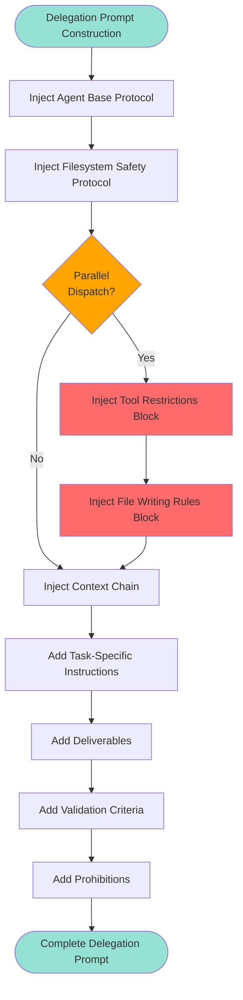
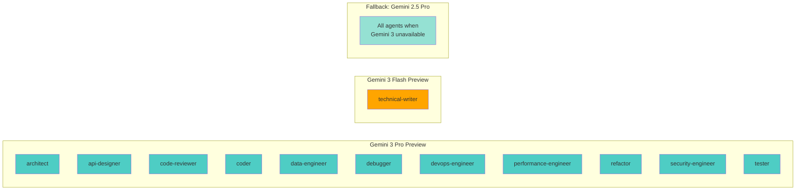

# Agent System Architecture

The Maestro agent system provides 12 specialized AI personas that execute implementation phases under TechLead orchestration (defined in `GEMINI.md`). The TechLead is the central orchestrator agent that coordinates all subagents — it designs, plans, delegates, and verifies but never writes code directly.

This document covers agent definition format, tool permissions, delegation mechanics, model configuration, and protocol injection. It is intended for contributors who want to understand, modify, or extend the agent system.

**Prerequisites:** Familiarity with the [System Overview](system-overview.md) and basic understanding of YAML frontmatter and Markdown.

## Key Concepts

| Term | Definition |
|------|-----------|
| **Agent** | AI persona with specialized domain expertise, defined as a Markdown file with YAML frontmatter in `agents/` |
| **TechLead / Orchestrator** | The central coordinating agent defined in `GEMINI.md` that delegates work to specialized agents |
| **Delegation Prompt** | Complete instructions sent to an agent, including protocols, context chain, task, deliverables, and constraints |
| **Tool Permission Tier** | Access level granted to an agent (read-only, read+shell, read+write, full access) |
| **Downstream Context** | Structured information produced by one agent (Part 2 of the Handoff Report) for use by subsequent agents |
| **Task Report** | Structured output every agent produces upon completion (Part 1 of the Handoff Report) |
| **Context Chain** | Accumulated downstream context from all completed phases, injected into each new delegation prompt |
| **Protocol** | Shared behavioral contract (Markdown file in `protocols/`) injected into every delegation prompt |
| **Parallel Dispatch** | Concurrent execution of independent agents via `scripts/parallel-dispatch.sh` as separate CLI processes |

## Agent Architecture

### Agent Definition Format

Agents are defined as Markdown files with YAML frontmatter located in `/agents/`. Each agent definition consists of two parts:

1. **Frontmatter Configuration** - YAML block defining metadata, tool permissions, and execution parameters
2. **Persona Definition** - Markdown body defining specialization, methodology, decision frameworks, and output contracts

### Frontmatter Schema

```yaml
---
name: agent-name
description: "One-line summary of agent specialization"
kind: local
tools:
  - read_file
  - glob
  - search_file_content
  - write_file
  - replace
  - run_shell_command
model: gemini-3-pro-preview
temperature: 0.2
max_turns: 25
timeout_mins: 10
---
```

#### Field Definitions

**name**: Agent identifier used in delegation prompts and parallel dispatch filenames. Must use kebab-case and match the definition filename without extension.

**description**: Human-readable summary shown in agent selection interfaces. Limited to one line.

**kind**: Agent deployment type. Always `local` for current implementation.

**tools**: Array of authorized tool names. Defines the agent's capability tier per the tool permission model. Available tools:
- `read_file` - Read file contents
- `glob` - Pattern-based file discovery
- `search_file_content` - Content search across files
- `write_file` - Create new files
- `replace` - Modify existing files
- `run_shell_command` - Execute shell commands
- `google_web_search` - Web search for research tasks

**model**: LLM model identifier. Supports Gemini 3 models (`gemini-3-pro-preview`, `gemini-3-flash-preview`) with automatic fallback to `gemini-2.5-pro` when Gemini 3 is unavailable.

**temperature**: Sampling temperature (0.0-1.0). Lower values (0.2-0.3) for deterministic tasks, higher values (0.5-0.7) for creative tasks.

**max_turns**: Maximum conversation turns before agent terminates. Higher for implementation agents (25), lower for analysis agents (15).

**timeout_mins**: Wall-clock timeout in minutes. Agent execution terminates if this limit is exceeded.

### Agent Loading Mechanism

The TechLead orchestrator (GEMINI.md) references agent definitions dynamically during delegation. The Gemini CLI loads agent definitions by:

1. Reading the YAML frontmatter to extract configuration
2. Parsing the Markdown body as the agent's system prompt
3. Applying environment variable overrides to configuration parameters
4. Constructing the delegation prompt with injected protocols and context

Agents do not run as persistent processes. Each delegation spawns a fresh agent instance via `gemini delegate_to_agent` (sequential) or `scripts/parallel-dispatch.sh` (parallel).

## Agent Catalog

### Complete Agent Roster

| Agent | Role | Tool Tier | Model | Temp | Turns | Timeout |
|-------|------|-----------|-------|------|-------|---------|
| **architect** | System design, architecture patterns, technology selection | Read-only | gemini-3-pro-preview | 0.3 | 15 | 5 min |
| **api-designer** | REST/GraphQL contract design, endpoint specification | Read-only | gemini-3-pro-preview | 0.3 | 15 | 5 min |
| **code-reviewer** | Code quality assessment, SOLID compliance, security review | Read-only | gemini-3-pro-preview | 0.2 | 15 | 5 min |
| **coder** | Feature implementation, clean code, SOLID principles | Full access | gemini-3-pro-preview | 0.2 | 25 | 10 min |
| **data-engineer** | Database schema, migrations, query optimization, ETL | Full access | gemini-3-pro-preview | 0.2 | 20 | 8 min |
| **debugger** | Root cause analysis, bug investigation, log analysis | Read + shell | gemini-3-pro-preview | 0.2 | 20 | 8 min |
| **devops-engineer** | CI/CD pipelines, containerization, infrastructure automation | Full access | gemini-3-pro-preview | 0.2 | 20 | 8 min |
| **performance-engineer** | Profiling, bottleneck identification, optimization recommendations | Read + shell | gemini-3-pro-preview | 0.2 | 20 | 8 min |
| **refactor** | Code modernization, structural improvement, pattern application | Read + write | gemini-3-pro-preview | 0.2 | 25 | 10 min |
| **security-engineer** | Vulnerability assessment, OWASP compliance, threat modeling | Read + shell | gemini-3-pro-preview | 0.2 | 20 | 8 min |
| **technical-writer** | Documentation, READMEs, API docs, developer guides | Read + write | gemini-3-flash-preview | 0.3 | 15 | 5 min |
| **tester** | Test creation, TDD workflows, coverage analysis | Full access | gemini-3-pro-preview | 0.2 | 25 | 10 min |

### Specialization Breakdown

#### Analysis Tier (Read-Only)

**architect** - Analyzes requirements and proposes system architecture. Produces component diagrams, interface contracts, dependency graphs, and trade-off analyses. Uses decision frameworks for pattern selection, technology evaluation, and scalability classification.

**api-designer** - Designs API contracts without implementation. Produces endpoint catalogs, request/response schemas, error contracts, and OpenAPI specifications. Applies decision frameworks for endpoint design, pagination strategies, error taxonomy, and versioning.

**code-reviewer** - Reviews code for quality, correctness, and security. Produces findings with severity classification, file/line references, and remediation guidance. Uses trace-before-report methodology to eliminate false positives.

#### Investigation Tier (Read + Shell)

**debugger** - Investigates defects through hypothesis-driven methodology. Traces execution paths, analyzes logs, and isolates root causes. Produces evidence-based findings with reproduction steps and recommended fixes.

**performance-engineer** - Profiles applications to identify bottlenecks. Uses flame graphs, heap snapshots, and load testing. Produces baseline metrics, optimization recommendations ranked by impact-to-effort ratio, and measurement plans.

**security-engineer** - Assesses security posture using OWASP Top 10 and STRIDE methodology. Maps attack surfaces, traces data flow for injection vulnerabilities, and audits dependencies. Produces vulnerability findings with CVSS-aligned severity and proof-of-concept exploits.

#### Modification Tier (Read + Write, No Shell)

**refactor** - Improves code structure while preserving behavior. Applies refactoring patterns systematically with behavior preservation verification at each step. Limited to structural changes only.

**technical-writer** - Creates and maintains documentation. Writes READMEs, API documentation, architecture decision records, and developer guides. Uses audience detection to tailor content depth and terminology.

#### Implementation Tier (Full Access)

**coder** - Implements features following SOLID principles and existing patterns. Uses interface-first workflow, dependency injection, and strict typing. Performs validation self-check before reporting completion.

**data-engineer** - Designs database schemas, writes migrations, and optimizes queries. Applies normalization decision protocols, index design methodology, and migration safety protocols. All migrations include rollback scripts.

**devops-engineer** - Builds CI/CD pipelines, containerizes applications, and automates infrastructure. Follows pipeline stage ordering protocol, container optimization decision tree, and secret management classification. Every deployment includes rollback capability.

**tester** - Creates comprehensive test suites following the test pyramid. Uses AAA pattern (Arrange, Act, Assert) with test isolation and boundary mocking. Applies edge case discovery protocol and test strategy selection framework.

## Tool Permission Model

### Four Permission Tiers

The tool permission model implements least-privilege access control. Each agent receives the minimum tools necessary for its specialization.

```mermaid
graph TB
    subgraph "Tier 4: Full Access"
        T4[coder, data-engineer,<br/>devops-engineer, tester]
        T4Tools[read_file, glob, search_file_content,<br/>write_file, replace, run_shell_command]
    end

    subgraph "Tier 3: Read + Write"
        T3[refactor, technical-writer]
        T3Tools[read_file, glob, search_file_content,<br/>write_file, replace]
    end

    subgraph "Tier 2: Read + Shell"
        T2[debugger, performance-engineer,<br/>security-engineer]
        T2Tools[read_file, glob, search_file_content,<br/>run_shell_command]
    end

    subgraph "Tier 1: Read-Only"
        T1[architect, api-designer,<br/>code-reviewer]
        T1Tools[read_file, glob, search_file_content]
    end

    T4 --> T4Tools
    T3 --> T3Tools
    T2 --> T2Tools
    T1 --> T1Tools

    style T4 fill:#ff6b6b
    style T3 fill:#ffa500
    style T2 fill:#4ecdc4
    style T1 fill:#95e1d3
```



#### Tier 1: Read-Only

**Authorized Tools**: `read_file`, `glob`, `search_file_content`, `google_web_search` (architect only)

**Agents**: architect, api-designer, code-reviewer

**Rationale**: Analysis agents produce recommendations and findings. They observe but never modify. Read-only access prevents accidental changes during investigation and enforces architectural separation between analysis and implementation.

**Constraints**: Cannot create files, modify files, or execute commands. Output consists purely of structured findings in the Task Report.

#### Tier 2: Read + Shell

**Authorized Tools**: `read_file`, `glob`, `search_file_content`, `run_shell_command`

**Agents**: debugger, performance-engineer, security-engineer

**Rationale**: Investigation agents need to execute diagnostic commands (profiling tools, security scanners, log analysis utilities) but should not modify application code. Shell access enables running analysis tools while write prohibition prevents fixing issues during investigation.

**Constraints**: Can execute read-only commands (grep, find, git log, profilers, linters) but cannot create or modify project files. Findings remain separate from fixes.

#### Tier 3: Read + Write

**Authorized Tools**: `read_file`, `glob`, `search_file_content`, `write_file`, `replace`

**Agents**: refactor, technical-writer

**Rationale**: Modification agents change file contents but should not execute arbitrary commands. Refactoring changes structure without behavioral modification. Documentation changes are purely textual.

**Constraints**: Can create and modify files within assigned scope but cannot run build tools, tests, or shell scripts. No access to command execution reduces risk of unintended side effects.

#### Tier 4: Full Access

**Authorized Tools**: `read_file`, `glob`, `search_file_content`, `write_file`, `replace`, `run_shell_command`

**Agents**: coder, data-engineer, devops-engineer, tester

**Rationale**: Implementation agents require full access to create files, modify code, run validation commands, and execute build/test pipelines. These agents drive actual implementation and must verify their work through automated checks.

**Constraints**: Scope boundaries defined in delegation prompts. Must run validation commands after making changes. Subject to agent base protocol and filesystem safety protocol.

### Permission Enforcement

#### Sequential Delegation

When using `gemini delegate_to_agent`, the Gemini CLI enforces tool restrictions based on the agent definition frontmatter. Unauthorized tool calls are rejected by the CLI.

#### Parallel Delegation

When using `scripts/parallel-dispatch.sh` with `--yolo` flag, tool restrictions are NOT enforced by the CLI. Instead, the delegation skill injects explicit tool restriction blocks into every parallel delegation prompt:

```
TOOL RESTRICTIONS (MANDATORY):
You are authorized to use ONLY the following tools: [list from agent frontmatter].
Do NOT use any tools not listed above. Specifically:
- Do NOT use write_file or replace unless explicitly authorized above
- Do NOT use run_shell_command unless explicitly authorized above
- Do NOT create, modify, or delete files unless authorized above
Violation of these restrictions constitutes a security boundary breach.
```

This prompt-based enforcement is the only mechanism for maintaining least-privilege in parallel dispatch until the Gemini CLI supports runtime tool restriction flags.

### Tool Selection Rationale

**read_file** - Universal tool for all agents. Observing code is required for every specialization.

**glob** - Universal file discovery. Enables agents to find relevant files matching patterns without exhaustive directory traversal.

**search_file_content** - Universal content search. Enables agents to locate code patterns, imports, and references.

**google_web_search** - Restricted to architect. Technology evaluation requires current information on libraries, frameworks, and ecosystem maturity.

**write_file** - Implementation and documentation agents only. Creating new files changes project state.

**replace** - Implementation and documentation agents only. Modifying existing files changes project state.

**run_shell_command** - Investigation and implementation agents only. Diagnostic commands and validation pipelines require shell access.

## Agent Protocols

### Agent Base Protocol

Location: `/protocols/agent-base-protocol.md`

The agent base protocol defines mandatory pre-work procedures and output formatting for all agents. Injected into every delegation prompt before task-specific instructions.

#### Pre-Flight Protocol

All agents execute three steps before beginning task work:

**Step 1 - Anchor to Project Reality**
- Read all files listed in delegation prompt in full
- Identify language, framework, runtime from configuration files
- Detect existing patterns: naming, directory structure, error handling, dependency injection, test framework
- Record observations as internal working context for consistency

**Step 2 - Scope Verification**
- Confirm files for modification exist
- Confirm files for creation have existing parent directories
- Verify task is achievable within tool permissions
- Verify task does not duplicate completed work
- Confirm no files outside delegation scope will be touched

If verification fails, agent reports the issue in Task Report and stops. No improvisation around scope or permission constraints.

**Step 3 - Convention Extraction**
- Extract and match project conventions for naming, structure, patterns, error handling, testing
- Follow existing conventions exactly - no alternative approaches
- If ambiguous, default to most common pattern observed
- Note ambiguities in Handoff Report if fewer than 3 examples exist

#### File Writing Rule

ALWAYS use `write_file` for creating files and `replace` for modifying files.

NEVER use `run_shell_command` with `cat`, `echo`, `printf`, heredocs, or shell redirection (`>`, `>>`). Shell interpretation corrupts YAML frontmatter, Markdown syntax, backticks, brackets, and special characters.

If `write_file` is not authorized, agent reports limitation in Task Report rather than using shell workarounds.

#### Output Handoff Contract

Every agent concludes with a Handoff Report containing two parts:

**Part 1 - Task Report**

```
### Task Report
- Status: success | partial | failure
- Objective Achieved: [one sentence restating task and completion status]
- Files Created: [absolute paths with one-line purpose, or "none"]
- Files Modified: [absolute paths with change summary, or "none"]
- Files Deleted: [absolute paths with rationale, or "none"]
- Decisions Made: [choices not specified in delegation prompt, or "none"]
- Validation: pass | fail | skipped
- Validation Output: [command output or "N/A"]
- Errors: [type, description, resolution status, or "none"]
- Scope Deviations: [incomplete items or discovered work, or "none"]
```

**Part 2 - Downstream Context**

Populated when agent output feeds subsequent phases. Read-only agents populate this with actionable findings.

```
### Downstream Context
- Key Interfaces Introduced: [type signatures and locations, or "none"]
- Patterns Established: [new patterns for consistency, or "none"]
- Integration Points: [where downstream work connects, or "none"]
- Assumptions: [items downstream should verify, or "none"]
- Warnings: [gotchas, edge cases, fragile areas, or "none"]
```

Part 2 is mandatory when the phase has downstream dependencies. The orchestrator extracts Downstream Context from completed phases and includes it in subsequent delegation prompts, creating an information chain.

### Filesystem Safety Protocol

Location: `/protocols/filesystem-safety-protocol.md`

The filesystem safety protocol prevents errors from missing directories during file operations. Injected into every delegation prompt after the agent base protocol.

#### Rule 1 - Ensure Before Write

Before any file creation, write, or move operation, verify the target's parent directory exists. If missing, create it using `mkdir -p`. This modifies the base protocol's Scope Verification Step 2: instead of stopping and reporting missing directories, create them and continue.

#### Rule 2 - Silent Success, Clear Failure

Directory creation is a precondition, not a reportable event. Do not report successful directory creation in Task Report. Only report failures (permission denied, disk full) as blockers.

#### Rule 3 - Never Assume Directory State

Treat every directory reference as potentially non-existent, even if a prior phase should have created it. Phases run independently, especially in parallel dispatch. Each agent ensures its own write targets exist.

#### Rule 4 - Path Construction

Always construct full paths before writing. Never write to paths assembled from unverified components. For target project operations, verify project root exists and is writable before creating subdirectories.

#### Rule 5 - Scope

Applies to Maestro state directories (`.gemini/state/`, `.gemini/plans/`, `.gemini/archive/`), target project directories, and all archive operations.

#### Rule 6 - Write Tool Only

Reinforces the agent base protocol's file writing rule. All file content must be written using `write_file` or `replace` tools. Never use `run_shell_command` with shell redirection or content generation commands.

### Protocol Injection Mechanism

The delegation skill (`skills/delegation/SKILL.md`) defines protocol injection as the first step in delegation prompt construction.



1. Read `protocols/agent-base-protocol.md`
2. Read `protocols/filesystem-safety-protocol.md`
3. Prepend both protocols to delegation prompt (base first, then filesystem safety)
4. Include Downstream Context from completed phases in `blocked_by` relationships
5. Add context chain, file manifest, and accumulated patterns from prior phases
6. Add task-specific instructions
7. Add scope boundaries and prohibitions

Every delegation prompt follows this structure:

```
[Agent Base Protocol]
[Filesystem Safety Protocol]
[Tool Restrictions Block - parallel only]
[File Writing Rules Block - parallel only]
[Context from completed phases]
[Task-specific instructions]
[Deliverables]
[Validation criteria]
[Prohibitions]
```

## Delegation Mechanics

```mermaid
sequenceDiagram
    participant O as Orchestrator
    participant AD as Agent Definition
    participant ENV as Environment Variables
    participant P as Protocols
    participant S as Session State
    participant A as Agent Instance

    O->>AD: Read agent definition file
    AD-->>O: Frontmatter config + persona
    O->>ENV: Apply env var overrides
    ENV-->>O: Modified config
    O->>P: Read agent-base-protocol.md
    P-->>O: Base protocol content
    O->>P: Read filesystem-safety-protocol.md
    P-->>O: Safety protocol content
    O->>S: Extract downstream context<br/>from completed phases
    S-->>O: Context chain
    O->>O: Construct delegation prompt:<br/>Protocols + Context + Task + Prohibitions

    alt Sequential Dispatch
        O->>A: delegate_to_agent(agent, prompt)
    else Parallel Dispatch
        O->>A: Write prompt to file
        O->>A: Execute parallel-dispatch.sh
    end

    A->>A: Execute task
    A-->>O: Task Report
    O->>O: Extract downstream context
    O->>S: Update session state

    style O fill:#ffa500
    style A fill:#4ecdc4
    style P fill:#95e1d3
```

### Sequential Delegation

The TechLead orchestrator uses `gemini delegate_to_agent` for sequential phase execution:

```
delegate_to_agent(
  agent: "agent-name",
  prompt: "[constructed delegation prompt]"
)
```

The Gemini CLI handles subagent spawning, tool permission enforcement, and response collection. The orchestrator blocks until the agent completes or times out.

#### Delegation Prompt Construction

1. Apply environment variable overrides to agent configuration
2. Inject agent base protocol and filesystem safety protocol
3. Include Downstream Context from phases in `blocked_by` relationships
4. Add context chain showing prior work
5. Specify absolute paths for files to create/modify
6. Define concrete deliverables
7. Include validation command
8. Add explicit prohibitions

#### Context Chain

Every delegation prompt includes context from prior phases:

```
Context from completed phases:
- Phase [N] ([agent]): [Downstream Context summary]
  - Interfaces introduced: [list with file locations]
  - Patterns established: [list]
  - Integration points: [specific files, functions, endpoints]
  - Warnings: [list]
```

If a `blocked_by` dependency has no stored downstream context, the prompt includes a visible placeholder:

```
- Phase [N] ([agent]): Downstream Context missing in session state — verify dependency output before implementation
```

#### Downstream Consumer Declaration

Every prompt declares who will consume the agent's output:

```
Your output will be consumed by: [downstream agent name(s)] who need [specific information]
```

This primes the agent to structure Downstream Context for maximum utility to the next agent in the chain.

### Parallel Delegation

Parallel delegation uses `scripts/parallel-dispatch.sh` to execute independent phases concurrently. Instead of calling `delegate_to_agent`, the orchestrator:

1. Writes complete prompt files to `<state_dir>/parallel/<batch-id>/prompts/<agent-name>.txt`
2. Invokes `./scripts/parallel-dispatch.sh <state_dir>/parallel/<batch-id>`
3. Waits for all agents in batch to complete
4. Collects results from `<state_dir>/parallel/<batch-id>/results/<agent-name>.md`

#### Prompt File Requirements

Each prompt file must be fully self-contained. The agent runs as an independent `gemini` process with no access to the orchestrator's conversation or session context.

Prompt files include:
- Agent base protocol
- Filesystem safety protocol
- Tool restrictions block (prompt-based enforcement)
- File writing rules block (reinforcement)
- Complete context from prior phases
- Task-specific instructions with absolute paths
- Deliverables and validation criteria
- Explicit prohibitions including "Do NOT ask follow-up questions" and "Do NOT create git commits"

#### Agent Name Validation

Prompt filenames must use hyphens (not underscores) and exactly match agent definition filenames in `/agents/`. The dispatch script validates agent names before execution and rejects unrecognized names with a list of available agents. This catches typos before wasting API calls and timeout windows.

#### Non-Overlapping File Ownership

When delegating to multiple agents in parallel, no two agents may be assigned the same file. Each file must have exactly one owner in a parallel batch. Shared files (barrel exports, configuration, dependency manifests) are reserved for a single agent or handled in a post-batch update step.

#### Batch Completion Gates

All agents in a parallel batch must complete before:
- Next batch of phases begins
- Shared/container files are updated
- Validation checkpoints run
- Orchestrator creates git commit for the batch

Parallel agents must NOT create git commits. The orchestrator commits after validating the entire batch.

### Scope Boundary Enforcement

#### Absolute Paths

All delegation prompts use absolute file paths. Never use relative paths or expect agents to search for files. The parallel dispatch script automatically prepends project root to prompts as a safety net, but delegation prompts should construct absolute paths explicitly.

#### Specific Deliverables

Define exactly what the agent should produce. Vague instructions ("implement the feature") lead to inconsistent results. Specific instructions ("Create UserService class with createUser(), getUserById(), and deleteUser() methods implementing the IUserService interface") produce consistent results.

#### Validation Criteria

Include exact commands to run after completion. Examples:
- `npm run lint && npm run test`
- `cargo build && cargo test`
- `go vet ./... && go test ./...`
- `python -m pytest tests/`

Agents run validation and report results in Task Report.

#### Explicit Exclusions

State what agents must NOT do:
- Files they must not modify
- Dependencies they must not add
- Patterns they must not introduce
- Scope they must not exceed

Example:

```
Do NOT:
- Modify files in /src/core/
- Add new npm dependencies
- Introduce alternative error handling patterns
- Create git commits
- Ask follow-up questions (parallel execution is non-interactive)
```

### Agent Selection

The implementation planning phase assigns agents to phases based on task domain:

| Task Domain | Agent | Rationale |
|-------------|-------|-----------|
| System architecture, component design | architect | Read-only analysis, architecture pattern expertise |
| API contracts, endpoint design | api-designer | Read-only, REST/GraphQL specialization |
| Feature implementation, coding | coder | Full access, SOLID principles, clean code |
| Code quality assessment | code-reviewer | Read-only, verified findings, trace-before-report |
| Database schema, queries, ETL | data-engineer | Full access, normalization, migration safety |
| Bug investigation, root cause | debugger | Read + shell, hypothesis-driven methodology |
| CI/CD, infrastructure, deployment | devops-engineer | Full access, pipeline design, containerization |
| Performance analysis, profiling | performance-engineer | Read + shell, bottleneck classification, optimization |
| Code restructuring, modernization | refactor | Read + write, behavior preservation, refactoring patterns |
| Security assessment, vulnerability | security-engineer | Read + shell, OWASP, STRIDE, attack surface mapping |
| Test creation, TDD, coverage | tester | Full access, test pyramid, edge case discovery |
| Documentation, READMEs, guides | technical-writer | Read + write, audience detection, example quality |

### Error Handling and Retry

Agents report errors in the Task Report Errors field. The orchestrator implements automatic retry:

- Maximum 2 retry attempts per phase
- Retry only on transient failures (timeout, rate limit, network error)
- No retry on validation failure or scope violation
- After maximum retries, escalate to user with error context

## Model Assignment Strategy

### Primary Model: Gemini 3 Pro



All agents use `gemini-3-pro-preview` except `technical-writer`. This provides:
- High reasoning capability for complex implementation and analysis tasks
- Consistency across agent outputs
- Sufficient context window for large file analysis

Configuration: `model: gemini-3-pro-preview`

### Exception: Technical Writer Uses Flash

The `technical-writer` agent uses `gemini-3-flash-preview` for:
- Faster execution on documentation tasks
- Lower cost for high-volume documentation generation
- Sufficient capability for structured writing tasks

Documentation does not require the same reasoning depth as architecture design or implementation. Flash model provides adequate quality with better performance.

Configuration: `model: gemini-3-flash-preview`

### Fallback: Gemini 2.5 Pro

When Gemini 3 models are unavailable (API error, regional restriction, deprecation), the system automatically falls back to `gemini-2.5-pro`. This fallback is transparent to the orchestrator and requires no configuration changes.

The fallback logic resides in the Gemini CLI, not in Maestro configuration.

### Environment Variable Overrides

The delegation skill applies environment variable overrides before constructing delegation prompts:

#### Global Overrides

- `MAESTRO_DEFAULT_MODEL` - Overrides `model` for all agents
- `MAESTRO_DEFAULT_TEMPERATURE` - Overrides `temperature` for all agents
- `MAESTRO_MAX_TURNS` - Overrides `max_turns` for all agents
- `MAESTRO_AGENT_TIMEOUT` - Overrides `timeout_mins` for all agents

#### Agent-Specific Overrides

- `MAESTRO_WRITER_MODEL` - Overrides `model` for `technical-writer` only (takes precedence over `MAESTRO_DEFAULT_MODEL`)

#### Precedence

Agent-specific environment variable > General environment variable > Agent frontmatter default

Example: For `technical-writer`, if both `MAESTRO_DEFAULT_MODEL=gemini-2.5-pro` and `MAESTRO_WRITER_MODEL=gemini-3-flash-preview` are set, the agent uses `gemini-3-flash-preview`.

#### Agent Disabling

`MAESTRO_DISABLED_AGENTS` - Comma-separated list of agent names to disable. If an agent appears in this list, the delegation skill skips prompt construction and reports to the orchestrator that the agent is disabled.

Example: `MAESTRO_DISABLED_AGENTS=security-engineer,performance-engineer`

### Temperature Calibration

**Low Temperature (0.2)**: Deterministic tasks requiring consistency
- code-reviewer (consistent severity classification)
- coder (pattern matching, implementation consistency)
- data-engineer (schema design, migration reliability)
- debugger (systematic root cause analysis)
- devops-engineer (infrastructure configuration)
- performance-engineer (measurement-driven analysis)
- refactor (behavior preservation)
- security-engineer (vulnerability classification)
- tester (test case generation)

**Medium Temperature (0.3)**: Tasks balancing consistency with creativity
- architect (architecture pattern selection)
- api-designer (endpoint design)
- technical-writer (documentation clarity)

Higher temperatures (>0.5) are not used. Maestro prioritizes consistency and correctness over creative variation.

### Turn Limits

**15 turns**: Analysis and documentation agents with bounded scope
- architect (architecture proposal)
- api-designer (API contract design)
- code-reviewer (code quality assessment)
- technical-writer (documentation generation)

**20 turns**: Investigation agents with exploratory workflows
- data-engineer (schema design with iteration)
- debugger (hypothesis testing)
- devops-engineer (pipeline configuration)
- performance-engineer (profiling and analysis)
- security-engineer (vulnerability assessment)

**25 turns**: Implementation agents with complex tasks
- coder (feature implementation)
- refactor (structural transformation)
- tester (comprehensive test suite creation)

Turn limits prevent runaway execution while allowing sufficient iterations for complex tasks.

### Timeout Configuration

**5 minutes**: Fast analysis and documentation tasks
- architect
- api-designer
- code-reviewer
- technical-writer

**8 minutes**: Investigation and specialized implementation tasks
- data-engineer
- debugger
- devops-engineer
- performance-engineer
- security-engineer

**10 minutes**: Complex implementation and refactoring tasks
- coder
- refactor
- tester

Timeouts prevent indefinite hangs while allowing sufficient time for file operations and validation execution.

## Creating a New Agent

Follow these steps to add a new specialized agent to Maestro.

### 1. Create the Agent Definition File

Create `agents/<agent-name>.md` using kebab-case naming. The filename (without extension) must match the `name` field in frontmatter.

```yaml
---
name: agent-name
description: "One-line summary of specialization"
kind: local
tools:
  - read_file
  - glob
  - search_file_content
model: gemini-3-pro-preview
temperature: 0.2
max_turns: 15
timeout_mins: 5
---
```

### 2. Choose Tool Permissions

Select the minimum tools required based on the agent's role:

| If the agent needs to... | Include these tools |
|--------------------------|-------------------|
| Analyze code (read-only) | `read_file`, `glob`, `search_file_content` |
| Run diagnostic commands | Add `run_shell_command` |
| Modify files | Add `write_file`, `replace` |
| Full implementation | All tools |

### 3. Write the Agent Persona

The Markdown body below the frontmatter defines the agent's behavior. Include:

- **Role and Expertise**: What the agent specializes in
- **Methodology**: Step-by-step approach the agent follows
- **Decision Frameworks**: Criteria for making choices (e.g., pattern selection, technology evaluation)
- **Output Contract**: Exact format of the agent's deliverables
- **Anti-Patterns**: Common mistakes the agent must avoid
- **Downstream Consumers**: Which agents will use this agent's output

### 4. Register with the Orchestrator

1. Add the agent to the roster table in `GEMINI.md`
2. Add agent assignment criteria in `skills/implementation-planning/SKILL.md`

### 5. Test the Agent

Link the extension and test via Gemini CLI:

```bash
gemini extensions link .
# Restart Gemini CLI, then test delegation:
gemini delegate_to_agent agent=agent-name prompt="Test task description"
```

### 6. Validate Permissions

Run the permission validation script:

```bash
./scripts/validate-agent-permissions.sh
```

This confirms the new agent's tool permissions conform to the least-privilege model.

## Best Practices

### Agent Definition Maintenance

- Keep persona definitions focused on methodology and decision frameworks
- Document anti-patterns to prevent common mistakes
- Include Downstream Consumers section to clarify information flow
- Maintain Output Contract consistency across all agents
- Update decision frameworks based on real-world usage patterns

### Delegation Prompt Quality

- Use absolute paths for all file references
- Specify concrete deliverables, not vague goals
- Include validation commands for implementation agents
- Add explicit prohibitions to prevent scope creep
- Declare downstream consumers to prime context generation

### Tool Permission Discipline

- Grant minimum necessary tools for each specialization
- Never grant write access to analysis agents
- Reserve shell access for investigation and implementation tiers
- Use prompt-based enforcement for parallel dispatch
- Review tool usage in agent definitions during maintenance

### Protocol Evolution

- Agent base protocol changes affect all agents simultaneously
- Filesystem safety protocol additions require prompt template updates
- Test protocol changes against all 12 agent personas before deployment
- Version protocol files when making breaking changes
- Document protocol version compatibility in agent definitions

### Performance Optimization

- Use parallel dispatch for independent phases
- Assign lower-cost flash model to high-volume documentation tasks
- Set aggressive timeouts for bounded analysis tasks
- Use lower turn limits for deterministic tasks
- Monitor actual turn usage and timeout rates to calibrate limits

### Error Prevention

- Validate agent names in parallel dispatch before execution
- Ensure non-overlapping file ownership in parallel batches
- Include complete context chains in all delegation prompts
- Add missing context placeholders when dependencies lack Downstream Context
- Enforce file writing rules through prompt injection, not trust
