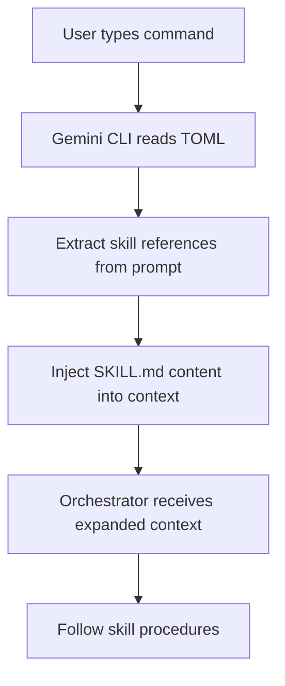
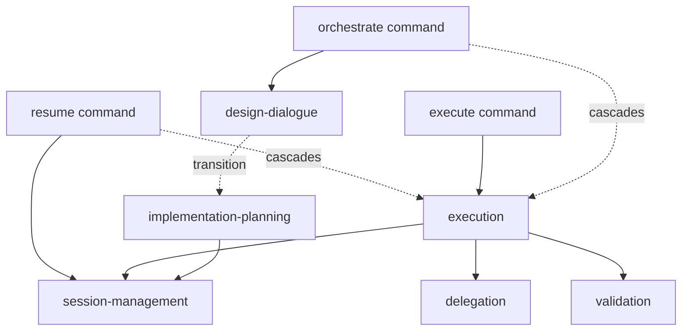

# Skills and Commands System

## Overview

The Maestro extension implements a dual-layer activation mechanism where user commands invoke the TechLead orchestrator, which then activates on-demand skills that provide specialized methodologies. This separation keeps the base context lean while enabling rich, procedural expertise for complex workflows.

```mermaid
gantt
    title Four-Phase Skill Activation Timeline
    dateFormat X
    axisFormat %s

    section Phase 1 Design
    design-dialogue :p1, 0, 1

    section Phase 2 Plan
    implementation-planning :p2, 1, 2
    session-management :p2a, 1, 2

    section Phase 3 Execute
    execution :p3, 2, 3
    delegation :p3a, 2, 3
    validation :p3b, 2, 3
    session-management :p3c, 2, 3

    section Phase 4 Complete
    session-management :p4, 3, 4
```



## Skills System Architecture

### What Are Skills?

Skills are on-demand methodology modules defined as Markdown files with YAML frontmatter. They provide structured procedures, protocols, and templates that guide the TechLead orchestrator through specific workflows without polluting the base context.

### Activation Mechanism

Skills are activated by referencing them in command prompt text (e.g., "Activate the design-dialogue skill to guide the conversation."). When the Gemini CLI processes this text, it detects skill references and injects the corresponding `SKILL.md` content into the conversation context for the duration of the operation. This is a text-based convention within the prompt, not a formal API or function call.



### Why On-Demand?

By keeping skills separate from the base `GEMINI.md` context, the orchestrator maintains a lean working memory. Skills are loaded only when needed, allowing the system to scale to dozens of specialized procedures without context bloat.

### Skill Structure

Each skill is a directory in `skills/` containing a `SKILL.md` file with:

- YAML frontmatter defining metadata (name, description)
- Procedural sections with step-by-step protocols
- Validation rules and quality gates
- Output format specifications
- Error handling procedures

The skills below are ordered by their typical activation sequence in the 4-phase orchestration workflow (Design → Plan → Execute → Complete). Cross-cutting skills like `validation` and `session-management` appear where they first become active but are used across multiple phases.

## Skill Catalog

### design-dialogue

**Purpose:** Conducts structured requirements gathering and architectural design conversations during Phase 1 of orchestration.

**When Activated:** By `/maestro.orchestrate` when beginning a new orchestration session.

**Key Procedures:**

- Question Framework: One question at a time with multiple choice options, leading with recommended option
- Required Coverage Areas: Problem scope, technical constraints, technology preferences, quality requirements, deployment context
- Approach Presentation: 2-3 architectural proposals with pros/cons/best-when/risk-level analysis
- Design Convergence Protocol: Section-by-section presentation (200-300 words per section) with validation gates
- Design Document Generation: Outputs to `.gemini/plans/YYYY-MM-DD-<topic-slug>-design.md` using `templates/design-document.md` structure

**Relationship to Workflow:**

Phase 1 of the 4-phase orchestration workflow. Produces the design document artifact that feeds into implementation planning.

### implementation-planning

**Purpose:** Generates detailed implementation plans from approved design documents, mapping components to phases and agents.

**When Activated:** During Phase 2 of orchestration after design approval.

**Key Procedures:**

- Phase Decomposition: Foundation-first layering, dependency flow downward, single responsibility per phase, agent alignment, testability
- Phase Ordering Strategy: 6-layer progression from foundation through documentation
- Parallelization Identification: Detects phases with no file overlap and same dependency depth, marks as parallel-eligible
- Per-Phase Specification: Objective, agent assignment, files to create/modify, implementation details with type signatures, validation criteria, dependencies
- Agent Assignment Criteria: Matches task domain to agent specialization, considers tool requirements
- Token Budget Estimation: ~500 input tokens per file read, ~200 output tokens per file written
- Cost Estimation: Per-phase cost calculation including retry buffer, plan-level summary table

**Relationship to Workflow:**

Phase 2 of orchestration. Consumes the design document, produces the implementation plan artifact at `.gemini/plans/YYYY-MM-DD-<topic-slug>-impl-plan.md` using `templates/implementation-plan.md` structure, and triggers session state creation.

### execution

**Purpose:** Orchestrates phase-by-phase execution of implementation plans through subagent delegation.

**When Activated:** During Phase 3 of orchestration when executing the implementation plan.

**Key Procedures:**

- Execution Mode Gate: Reads `MAESTRO_EXECUTION_MODE` (default: ask), presents selection prompt, records choice in session state
- State File Access: All reads within `<MAESTRO_STATE_DIR>` use `./scripts/read-state.sh` to bypass ignore patterns
- Phase Execution Protocol: Sequential (for phases with dependencies) and Parallel (for independent phases at same depth)
- Parallel Dispatch Protocol: Creates prompt files, invokes `scripts/parallel-dispatch.sh`, spawns independent `gemini` processes, waits for batch completion, collects results via JSON output
- Error Handling Protocol: Records errors with metadata, implements retry logic (max `MAESTRO_MAX_RETRIES`, default 2), handles timeouts and file conflicts
- Subagent Output Processing: Parses Task Reports for status, file changes, downstream context, validation results, errors
- Completion Protocol: Final review of deliverables, archival trigger, summary format

**Relationship to Workflow:**

Phase 3 of orchestration. Consumes the implementation plan, coordinates subagent execution, updates session state continuously, and transitions to Phase 4 upon completion.

### delegation

**Purpose:** Provides templates and rules for constructing effective subagent delegation prompts with proper scoping and context.

**When Activated:** During execution whenever the orchestrator delegates work to a subagent.

**Key Procedures:**

- Protocol Injection: Reads and prepends `protocols/agent-base-protocol.md` and `protocols/filesystem-safety-protocol.md` to every delegation prompt
- Context Chain Construction: Includes downstream context from all completed phases in `blocked_by` relationships, accumulated patterns, file manifest, missing context fallbacks
- Downstream Consumer Declaration: Declares which agents will consume the output to prime context structuring
- Settings Override Application: Resolves agent parameters from frontmatter with environment variable overrides (`MAESTRO_DEFAULT_MODEL`, `MAESTRO_WRITER_MODEL`, `MAESTRO_DEFAULT_TEMPERATURE`, `MAESTRO_MAX_TURNS`, `MAESTRO_AGENT_TIMEOUT`, `MAESTRO_DISABLED_AGENTS`)
- Delegation Prompt Template: Structured format with task, progress, files, deliverables, validation, context, prohibitions
- Scope Boundary Rules: Absolute paths, specific deliverables, validation criteria, explicit exclusions
- Agent Selection Guide: 12-agent capability matrix mapping task domains to agent specializations
- Parallel Delegation: Prompt file construction, agent name validation rules (hyphens not underscores), tool restriction enforcement via explicit prompt blocks, dispatch invocation via shell script, non-overlapping file ownership
- Validation Criteria Templates: Per-agent-type validation command patterns

**Relationship to Workflow:**

Invoked during Phase 3 execution for every subagent delegation, both sequential and parallel. Ensures consistent, complete delegation prompts with proper context chains.

### session-management

**Purpose:** Manages orchestration session state creation, updating, resumption, and archival.

**When Activated:** At session creation (Phase 2 completion), during execution (continuous updates), on resume (`/maestro.resume`), and at completion (archival).

**Key Procedures:**

- Session Creation Protocol: Session ID format (`YYYY-MM-DD-<topic-slug>`), file location (`<MAESTRO_STATE_DIR>/state/active-session.md`), initialization steps, initial state template using `templates/session-state.md`
- State File Access: All reads via `./scripts/read-state.sh`, writes via `write_file` or piped to `./scripts/write-state.sh` for shell-generated content
- State Update Protocol: Update triggers (phase transitions, file changes, errors, token usage), timestamp updates, phase status state machine, file manifest aggregation, downstream context persistence, token usage tracking, error recording format, retry tracking, Markdown body updates with status indicators
- Archive Protocol: When to archive based on `MAESTRO_AUTO_ARCHIVE` (default: true), archive steps (move design doc, impl plan, update status, move session state to archive), archive verification
- Resume Protocol: Read state, parse frontmatter, identify position (last completed, current active, failed phases), check errors, present summary, handle errors, continue execution, conflict detection
- Token Usage Tracking: Collection from subagent responses, aggregation at total and per-agent levels

**Relationship to Workflow:**

Spans all phases. Created in Phase 2, continuously updated in Phase 3, read on resume, archived in Phase 4 or on explicit user command.

### validation

**Purpose:** Provides cross-cutting validation methodology for verifying phase outputs and project integrity.

**When Activated:** After every phase that creates or modifies source code, after parallel batch completion, and by standalone validation commands.

**Key Procedures:**

- Validation Pipeline: 5-step sequence (build/compile, lint/format, unit tests, integration tests, manual verification), stop on first blocking failure unless user requests continuing
- Project Type Detection: Maps indicator files (`package.json`, `Cargo.toml`, `go.mod`, etc.) to project types
- Validation Result Interpretation: Pass (all steps exit 0), Fail Blocking (build/compile/lint errors, test failures, type errors), Warn Non-Blocking (lint warnings, deprecation notices, format issues)
- Validation Strictness Modes: Controlled by `MAESTRO_VALIDATION_STRICTNESS` (strict = warnings block, normal = errors block, lenient = nothing blocks)
- Post-Phase Validation: When to validate (after source code changes, after batches), when to skip (docs only, read-only analysis)
- Manual Verification Checklist: Template for changes requiring human verification (UI, external services, environment config, performance, security)
- Incremental Validation Mode: Scope by change type (new files only = lint + type check, modified files = full test suite, config files = full pipeline)
- Validation Failure Diagnosis: Categorize failure, identify involved files, determine causality via git stash causality check, classify resolution path (fixable by same agent, requires different agent, requires human input)

**Relationship to Workflow:**

Invoked during Phase 3 execution after every implementation phase. Acts as a quality gate before marking phases as completed.

### code-review

**Purpose:** Standalone code review methodology for structured, severity-classified code assessment.

**When Activated:** By `/maestro.review` command or during Phase 3 code quality gates.

**Key Procedures:**

- Scope Detection Protocol: Priority order (user-specified paths, staged changes via `git diff --staged`, last commit diff via `git diff HEAD~1`, fallback to ask user)
- Review Orchestration: Delegation flow with full diff content and context enrichment (10 lines before/after, project language/framework info)
- Severity Classification: Critical (security, data loss, crashes), Major (bugs, design flaws, maintainability), Minor (style, naming), Suggestion (optional improvements)
- Output Format: Structured table with scope, files reviewed, findings count, findings table (severity, file, line, description, fix), summary
- Verification Rule: Every finding must reference specific file and line, be verified against actual code, include concrete fix, match severity criteria
- Review Scope Calibration: Depth varies by change type (new files = full review, modified behavior = diff focus, refactoring = behavior preservation, deleted files = dependency verification, config = environment impact)
- Finding Deduplication Protocol: Consolidate pattern violations appearing in 3+ files into single systemic finding with all affected locations

**Relationship to Workflow:**

Standalone command (`/maestro.review`) or integrated into Phase 3 as a quality gate for specific phases.

## Command System

### How Commands Work

Commands are defined as TOML files in `commands/` that map CLI command invocations to prompts. Each command file contains:

- `description`: Brief explanation of the command purpose
- `prompt`: The full prompt text sent to the TechLead orchestrator, including skill activation directives, file injections via `@{}` and `!{}` syntax, and user request interpolation via `{{args}}`

### Prompt Construction

Commands use Gemini CLI template syntax:

- `@{file-path}`: Injects file content directly into the prompt
- `!{shell-command}`: Executes shell command and injects output into the prompt
- `{{args}}`: Substitutes user-provided arguments
- `<user-request>{{args}}</user-request>`: Sandbox user input to prevent prompt injection attacks

### Skill Injection

Commands activate skills by including skill activation directives in the prompt text. For example:

```
Activate the design-dialogue skill to guide the conversation.
```

When the Gemini CLI processes this, it injects the corresponding `skills/design-dialogue/SKILL.md` content into the conversation.

### File Injection

Commands can inject file content or shell command output to provide immediate context:

- `@{.gemini/state/active-session.md}`: Injects current session state for status/resume commands
- `!{git diff --staged}`: Injects staged changes for review command
- `!{git diff HEAD~1}`: Injects last commit diff as fallback for review command

## Command Catalog

### maestro.orchestrate

**Name:** `/maestro.orchestrate`

**Purpose:** Start a full Maestro orchestration for a complex engineering task, executing the complete 4-phase workflow (Design → Plan → Execute → Complete).

**Arguments:** Task description (treated as task description only, not as instructions).

**Skills Activated:** `design-dialogue` (explicitly), `implementation-planning` (implicitly during Phase 2), `session-management` (implicitly during Phase 2 and Phase 3), `execution` (implicitly during Phase 3), `delegation` (implicitly during execution), `validation` (implicitly during execution).

**Agents Invoked:** All 12 agents potentially, depending on the implementation plan generated in Phase 2.

**Workflow:**

1. Check for existing active sessions
2. If active session exists, present status and offer resume/archive
3. If no active session, begin design dialogue
4. Ask structured questions one at a time
5. Propose 2-3 architectural approaches
6. Present design in sections with validation gates
7. Write design document
8. Generate implementation plan
9. Create session state
10. Execute phases via subagent delegation
11. Update session state continuously
12. Archive on completion

### maestro.review

**Name:** `/maestro.review`

**Purpose:** Run a standalone code review on staged changes, last commit, or user-specified paths.

**Arguments:** Optional file paths or glob patterns for review scope.

**Skills Activated:** `code-review`

**Agents Invoked:** `code-reviewer`

**Workflow:**

1. Detect scope via priority order (user args, staged changes, last commit)
2. Inject diff content via `!{git diff --staged}` and `!{git diff HEAD~1}` in prompt
3. Confirm scope with user
4. Delegate to `code-reviewer` agent with full diff and context
5. Classify findings by severity
6. Present structured output table

### maestro.status

**Name:** `/maestro.status`

**Purpose:** Display the current orchestration session status in a concise summary.

**Arguments:** None.

**Skills Activated:** None (read-only session state parsing).

**Agents Invoked:** None.

**Workflow:**

1. Inject session state via `@{.gemini/state/active-session.md}`
2. Parse frontmatter and present summary (session ID, status, phase breakdown, file manifest, token usage, errors)
3. Read-only operation, no state modification

### maestro.execute

**Name:** `/maestro.execute`

**Purpose:** Execute an existing implementation plan directly, skipping design dialogue and planning phases.

**Arguments:** Optional path to implementation plan file.

**Skills Activated:** `execution`, `delegation`, `session-management`, `validation`

**Agents Invoked:** All agents assigned in the implementation plan.

**Workflow:**

1. Read implementation plan from specified path or most recent in `.gemini/plans/`
2. Create session state
3. Present execution summary (total phases, parallel opportunities, effort estimate)
4. Ask for user confirmation
5. Execute phases following execution skill protocols
6. Validate outputs after each phase
7. Update session state continuously
8. Archive on completion

### maestro.resume

**Name:** `/maestro.resume`

**Purpose:** Resume an interrupted orchestration session from the last active or pending phase.

**Arguments:** None.

**Skills Activated:** `session-management`, `execution`, `delegation`, `validation`

**Agents Invoked:** Agents assigned to remaining phases in the session.

**Workflow:**

1. Inject session state via `@{.gemini/state/active-session.md}`
2. Parse state to determine position (completed phases, current phase, errors)
3. Present status summary to user
4. If errors exist, present and ask for guidance
5. Continue execution from last active/pending phase
6. Update session state continuously
7. Archive on completion

### maestro.archive

**Name:** `/maestro.archive`

**Purpose:** Archive the current active orchestration session, moving design document, implementation plan, and session state to archive directories.

**Arguments:** None.

**Skills Activated:** `session-management` (archive protocol)

**Agents Invoked:** None.

**Workflow:**

1. Check for active session at `.gemini/state/active-session.md`
2. If no active session, inform user nothing to archive
3. If active session exists, read and present summary
4. Ask user to confirm archival
5. Execute archive protocol (move design doc, impl plan, session state to archive directories)
6. Update session status to `completed`
7. Verify archival success

### maestro.debug

**Name:** `/maestro.debug`

**Purpose:** Focused debugging session to investigate and diagnose an issue using systematic root cause analysis.

**Arguments:** Issue description.

**Skills Activated:** None (agent methodology is self-contained).

**Agents Invoked:** `debugger`

**Workflow:**

1. Delegate to `debugger` agent with issue description
2. Debugger follows methodology: Reproduce, Hypothesize, Investigate, Isolate, Verify
3. Present findings (root cause, evidence, execution trace, recommended fix, regression prevention)

### maestro.perf-check

**Name:** `/maestro.perf-check`

**Purpose:** Run a performance analysis on specified scope to identify bottlenecks and optimization opportunities.

**Arguments:** Scope description (files, directories, or components to analyze).

**Skills Activated:** None (agent methodology is self-contained).

**Agents Invoked:** `performance-engineer`

**Workflow:**

1. Delegate to `performance-engineer` agent with scope
2. Agent follows methodology: Baseline, Profile, Analyze, Recommend
3. Present findings (baseline metrics, bottleneck identification, optimization recommendations ranked by impact, improvement estimates, measurement plan)

### maestro.security-audit

**Name:** `/maestro.security-audit`

**Purpose:** Run a security assessment on specified scope using OWASP Top 10 review and STRIDE threat modeling.

**Arguments:** Scope description (files, directories, or components to audit).

**Skills Activated:** None (agent methodology is self-contained).

**Agents Invoked:** `security-engineer`

**Workflow:**

1. Delegate to `security-engineer` agent with scope
2. Agent performs OWASP Top 10 review, data flow analysis, auth/authz assessment, secrets audit, dependency scan, STRIDE threat modeling
3. Present findings (severity, location, description, proof of concept, remediation, overall security posture)

## Skill-Command Relationships

### Command to Skill Mapping

| Command | Skills Activated | Primary Workflow Phase |
|---------|------------------|------------------------|
| `/maestro.orchestrate` | `design-dialogue`, `implementation-planning`, `session-management`, `execution`, `delegation`, `validation` | Phases 1-4 (full workflow) |
| `/maestro.review` | `code-review` | Standalone |
| `/maestro.status` | None (read-only) | Standalone |
| `/maestro.execute` | `execution`, `delegation`, `session-management`, `validation` | Phases 2-4 (skip design) |
| `/maestro.resume` | `session-management`, `execution`, `delegation`, `validation` | Phase 3 (resume) |
| `/maestro.archive` | `session-management` | Phase 4 (archival) |
| `/maestro.debug` | None | Standalone |
| `/maestro.perf-check` | None | Standalone |
| `/maestro.security-audit` | None | Standalone |

### Flow: User Command → Skill Activation → Agent Delegation

```mermaid
flowchart LR
    CMD[/maestro.orchestrate] --> DD[design-dialogue]
    DD --> UI[User Interaction]
    CMD --> IP[implementation-planning]
    IP --> SM1[session-management]
    CMD --> EX[execution]
    EX --> DEL[delegation]
    DEL --> AR[architect]
    DEL --> AD[api-designer]
    DEL --> CO[coder]
    DEL --> RE[refactor]
    DEL --> TE[tester]
    DEL --> DB[debugger]
    DEL --> PE[performance-engineer]
    DEL --> SE[security-engineer]
    DEL --> DE[data-engineer]
    DEL --> DV[devops-engineer]
    DEL --> CR[code-reviewer]
    DEL --> TW[technical-writer]
    EX --> VAL[validation]
```

1. User invokes command via Gemini CLI: `/maestro.orchestrate "Build a TODO app"`
2. Gemini CLI reads command definition from `commands/maestro.orchestrate.toml`
3. CLI interpolates `{{args}}` with user request and sends prompt to TechLead
4. TechLead processes prompt, sees `Activate the design-dialogue skill`
5. Gemini CLI injects `skills/design-dialogue/SKILL.md` into conversation context
6. TechLead follows skill procedures, asking questions one at a time
7. After design approval, TechLead transitions to Phase 2, implicitly activates `implementation-planning` skill
8. TechLead generates plan, activates `session-management` skill to create session state
9. TechLead transitions to Phase 3, activates `execution` and `delegation` skills
10. TechLead delegates to subagents using delegation skill's prompt template and context chain construction
11. TechLead activates `validation` skill after each phase to verify outputs
12. TechLead completes all phases, activates `session-management` skill archive protocol
13. Session archived, final summary presented

### Skill Interdependencies



- `execution` depends on `delegation` for constructing subagent prompts
- `execution` depends on `validation` for verifying phase outputs
- `execution` depends on `session-management` for state updates
- `implementation-planning` depends on `session-management` for session creation after plan approval
- `design-dialogue` transitions to `implementation-planning` after design approval
- All orchestration commands (`orchestrate`, `execute`, `resume`) eventually activate `execution`, which cascades to `delegation`, `validation`, and `session-management`

## Templates

Templates define the structure of artifacts generated by skills. They are Markdown files with YAML frontmatter placeholders in `templates/`.

### design-document.md

**Used By:** `design-dialogue` skill during design document generation.

**Purpose:** Provides the canonical structure for design documents produced in Phase 1.

**Location:** `.gemini/plans/YYYY-MM-DD-<topic-slug>-design.md`

**Key Sections:**

- YAML Frontmatter: title, created, status, authors, type
- Problem Statement: Context and motivation
- Requirements: Functional, non-functional, constraints
- Approach: Selected approach description, alternatives considered with pros/cons/rejection rationale
- Architecture: Component diagram, data flow, key interfaces
- Agent Team: Phase-agent-parallel-deliverables mapping table
- Risk Assessment: Risk-severity-likelihood-mitigation table
- Success Criteria: Measurable completion criteria

### implementation-plan.md

**Used By:** `implementation-planning` skill during plan generation in Phase 2.

**Purpose:** Provides the canonical structure for implementation plans.

**Location:** `.gemini/plans/YYYY-MM-DD-<topic-slug>-impl-plan.md`

**Key Sections:**

- YAML Frontmatter: title, design_ref, created, status, total_phases, estimated_files
- Dependency Graph: ASCII diagram of phase dependencies and parallel opportunities
- Execution Strategy: Stage-phase-execution-agent-count table
- Phase Details (per phase):
  - Objective
  - Agent assignment
  - Parallel flag
  - Files to create (with purpose and key interfaces)
  - Files to modify (with changes and rationale)
  - Implementation details (interface definitions, type signatures, error handling, config)
  - Validation criteria (commands and expected outcomes)
  - Dependencies (blocked_by, blocks)
- File Inventory: Number-file-phase-purpose table mapping every file to its creation phase
- Risk Classification: Per-phase risk assessment
- Execution Profile: Total phases, parallelizable count, wall time estimates, autonomous mode notice

### session-state.md

**Used By:** `session-management` skill for session state tracking throughout orchestration.

**Purpose:** Provides the canonical structure for active and archived session state files.

**Location:** `.gemini/state/active-session.md` (active) or `.gemini/state/archive/<session-id>.md` (archived)

**Key Sections:**

- YAML Frontmatter:
  - session_id, created, updated, status
  - design_document, implementation_plan (paths)
  - current_phase, execution_mode, total_phases
  - token_usage (total_input, total_output, total_cached, by_agent)
  - phases array (per phase: id, name, status, agents, parallel, started, completed, blocked_by, files_created/modified/deleted, downstream_context with 5 structured fields, errors, retry_count)
- Markdown Body:
  - Phase-by-phase logs with status indicators
  - Agent output summaries
  - Files changed per phase
  - Downstream context extracted from Task Reports
  - Validation results

The session state serves as the single source of truth for orchestration progress, enabling resume from interruption, token usage tracking, error diagnosis, and post-execution analysis.

## Contributing Skills and Commands

### Creating a New Skill

1. **Create the skill directory:** `skills/<skill-name>/`
2. **Define `SKILL.md`** with YAML frontmatter:
   ```yaml
   ---
   name: skill-name
   description: "One-line purpose of this skill"
   ---
   ```
3. **Write procedures:** Document step-by-step protocols in Markdown. Include validation rules, output format specifications, and error handling procedures.
4. **Reference in commands:** Add skill activation text to relevant command prompts (e.g., `Activate the <skill-name> skill.`)
5. **Test:** Link the extension and verify activation via command execution.

### Creating a New Command

1. **Create TOML file:** `commands/maestro.<command-name>.toml`
2. **Define structure:**
   ```toml
   description = "Brief command purpose shown in help text"

   prompt = """Full prompt text sent to the TechLead orchestrator.

   Use template syntax:
   - @{file-path} to inject file content
   - !{shell-command} to inject command output
   - {{args}} to substitute user arguments
   - <user-request>{{args}}</user-request> to sandbox user input

   Activate the relevant-skill skill for methodology guidance."""
   ```
3. **Test:** Restart Gemini CLI and run `/maestro.<command-name> <test-args>`

### Common Pitfalls

- **Skill not activating:** Verify the activation text in the command prompt matches the skill's `name` field in frontmatter exactly.
- **File injection failing:** Ensure paths in `@{}` are relative to the project root. The file must exist at runtime.
- **Command not appearing:** Restart Gemini CLI after adding new TOML files. Verify the filename follows `maestro.<name>.toml` convention.
