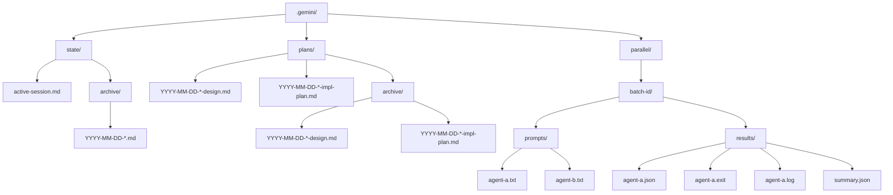
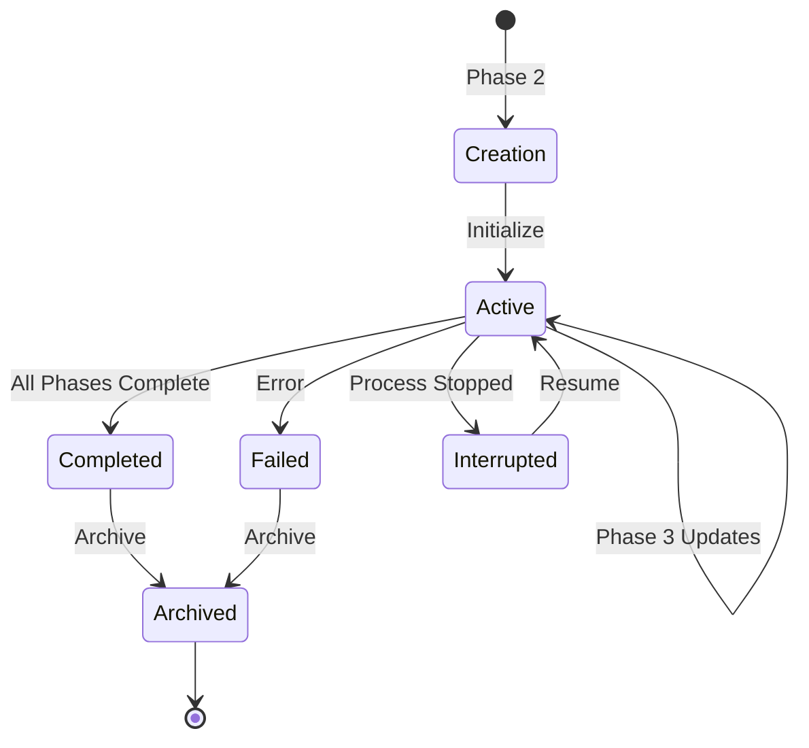
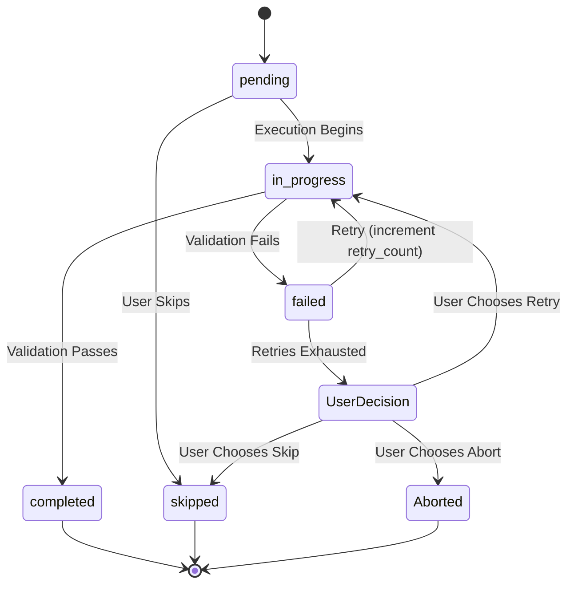
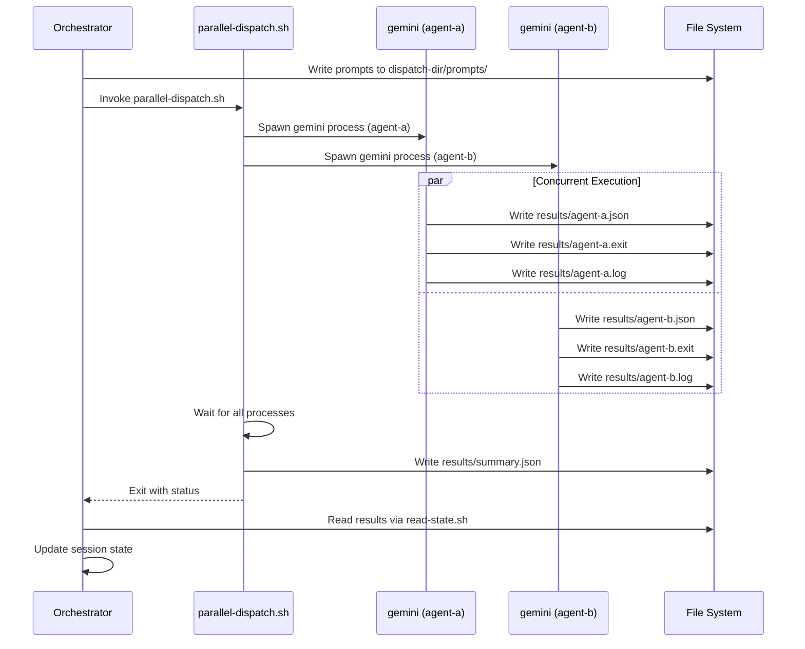
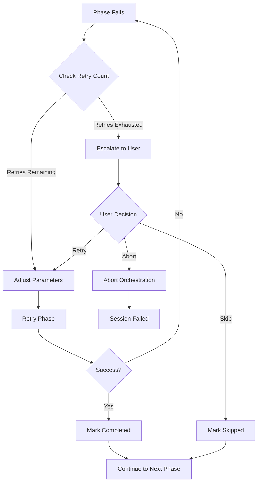

# State Management and Scripts

This document provides a comprehensive reference for session state management and the scripts infrastructure in the Maestro Gemini CLI extension.

## State Management Architecture

Maestro persists orchestration session state in the target project, not within the extension directory. This ensures that session state travels with the project being modified and remains accessible across Gemini CLI invocations.

### Directory Structure

State and plans are stored in the `MAESTRO_STATE_DIR` directory (default: `.gemini`) within the target project root. The state directory is structured as follows:

```
.gemini/
├── state/
│   ├── active-session.md        (current orchestration session)
│   └── archive/
│       └── YYYY-MM-DD-*.md      (completed sessions)
├── plans/
│   ├── YYYY-MM-DD-*-design.md
│   ├── YYYY-MM-DD-*-impl-plan.md
│   └── archive/
│       ├── YYYY-MM-DD-*-design.md
│       └── YYYY-MM-DD-*-impl-plan.md
└── parallel/
    └── <batch-id>/              (temporary parallel dispatch workspace)
        ├── prompts/
        │   ├── agent-a.txt
        │   └── agent-b.txt
        └── results/
            ├── agent-a.json
            ├── agent-a.exit
            ├── agent-a.log
            └── summary.json
```



### State File Format

All session state and plan documents use YAML frontmatter combined with Markdown body. This hybrid format provides both structured metadata for programmatic access and human-readable narrative logging.

**YAML Frontmatter**: Structured metadata including session ID, status, phase tracking, token usage, file manifests, and error records.

**Markdown Body**: Narrative log of execution progress, agent outputs, validation results, and human-readable summaries.

### File Access Restrictions

The `MAESTRO_STATE_DIR` directory is typically added to `.gitignore` and other ignore patterns. Standard `read_file` tool access may fail due to these restrictions. All state file access must go through dedicated I/O scripts:

**Reading state files:**
```bash
./scripts/read-state.sh <relative-path>
```

**Writing state files:**
Use `write_file` as the primary mechanism. When piping from shell commands:
```bash
echo '...' | ./scripts/write-state.sh <relative-path>
```

These scripts bypass ignore patterns and provide validation against path traversal attacks.

## Session Lifecycle



### Session Creation

Sessions are created during Phase 2 (Team Assembly & Planning) after the design document has been approved. The TechLead orchestrator activates the `session-management` skill and follows the initialization protocol.

**Session ID Format:**
```
YYYY-MM-DD-<topic-slug>
```

Where `YYYY-MM-DD` is the orchestration start date and `<topic-slug>` is a lowercase, hyphenated summary matching the design document topic.

**Initialization Steps:**

1. Resolve state directory from `MAESTRO_STATE_DIR` environment variable (default: `.gemini`)
2. Verify no existing `active-session.md` exists — if found, prompt user to archive or resume
3. Generate session state from `templates/session-state.md` template
4. Initialize all phases with `status: pending`
5. Set overall session `status: in_progress`
6. Set `current_phase: 1`
7. Record paths to design document and implementation plan
8. Initialize empty token usage, file manifests, downstream context, and error arrays

**Initial State Structure:**

```yaml
---
session_id: "YYYY-MM-DD-topic-slug"
created: "2026-02-14T22:58:00Z"
updated: "2026-02-14T22:58:00Z"
status: "in_progress"
design_document: ".gemini/plans/2026-02-14-topic-design.md"
implementation_plan: ".gemini/plans/2026-02-14-topic-impl-plan.md"
execution_mode: null
current_phase: 1
total_phases: 3

token_usage:
  total_input: 0
  total_output: 0
  total_cached: 0
  by_agent: {}

phases:
  - id: 1
    name: "Phase Name"
    status: "pending"
    agents: []
    parallel: false
    started: null
    completed: null
    blocked_by: []
    files_created: []
    files_modified: []
    files_deleted: []
    downstream_context:
      key_interfaces_introduced: []
      patterns_established: []
      integration_points: []
      assumptions: []
      warnings: []
    errors: []
    retry_count: 0
---

# Topic Orchestration Log

## Phase 1: Phase Name

### Status
Pending

### Agent Output
[Agent output will be recorded here as execution proceeds]

### Files Changed
- Created: [none yet]
- Modified: [none yet]
- Deleted: [none yet]

### Validation Result
[Pending]
```

### Phase State Transitions

Phase status follows a defined transition model enforced by the orchestrator:

```
pending → in_progress → completed
                      ↘ failed → in_progress (retry, max 2 by default)
                      ↘ skipped (user decision only)
```



**Valid Transitions:**
- `pending` to `in_progress`: Phase execution begins
- `in_progress` to `completed`: Phase validation passes, all deliverables confirmed
- `in_progress` to `failed`: Phase validation fails or error occurs
- `failed` to `in_progress`: Retry attempt (increments `retry_count`)
- `pending` to `skipped`: User explicitly skips phase (dependency resolution allows this)

### State Update Triggers

Session state is updated on every meaningful state change:

- Phase status transitions
- File manifest changes (creation, modification, deletion)
- Downstream context extraction from completed phases
- Error occurrences
- Token usage increments
- Phase completion or failure

**Update Rules:**

1. Update `updated` timestamp on every state change
2. Transition phase status following valid transitions only
3. Update `current_phase` to the ID of the currently executing phase
4. Append to `files_created`, `files_modified`, or `files_deleted` as subagents report changes
5. Persist parsed Handoff Report Part 2 fields into phase `downstream_context`
6. Aggregate token counts from subagent responses into both `total_*` and `by_agent` sections
7. Append to phase `errors` array with complete metadata

**Error Recording Format:**

```yaml
errors:
  - agent: "coder"
    timestamp: "2026-02-14T23:07:00Z"
    type: "validation"
    message: "Build failed: missing dependency @types/node"
    resolution: "Added dependency and retried"
    resolved: true
```

**Error Types:**
- `validation`: Validation script failure
- `timeout`: Agent exceeded timeout limit
- `file_conflict`: Concurrent modification detected
- `runtime`: Execution error within agent
- `dependency`: Missing dependency or blocked phase incomplete
- `quota`: API quota exhaustion

### Session Archival

Sessions are archived when all phases complete successfully or when explicitly requested by the user.

**Archive Triggers:**

- All phases are `completed` AND `MAESTRO_AUTO_ARCHIVE` is `true` (default)
- User explicitly requests archival via `/maestro.archive` command
- User starts a new orchestration (previous session must be archived first)

When `MAESTRO_AUTO_ARCHIVE` is `false`, the orchestrator prompts: "Session complete. Auto-archive is disabled. Would you like to archive this session?"

**Archive Steps:**

1. Create `<state_dir>/plans/archive/` directory if it does not exist
2. Create `<state_dir>/state/archive/` directory if it does not exist
3. Move design document from `<state_dir>/plans/` to `<state_dir>/plans/archive/`
4. Move implementation plan from `<state_dir>/plans/` to `<state_dir>/plans/archive/`
5. Update session state `status` to `completed`
6. Update `updated` timestamp
7. Move `active-session.md` from `<state_dir>/state/` to `<state_dir>/state/archive/<session-id>.md`
8. Confirm archival to user with summary

**Archive Verification:**

After archival, the orchestrator verifies:
- No `active-session.md` exists in `<state_dir>/state/`
- Archived files are readable at their new locations
- Plan files are no longer in active `<state_dir>/plans/` directory

### Session Resume Protocol

Sessions can be resumed via the `/maestro.resume` command or when `/maestro.orchestrate` detects an existing active session.

**Resume Steps:**

1. Read state via `./scripts/read-state.sh <MAESTRO_STATE_DIR>/state/active-session.md`
2. Parse YAML frontmatter for session metadata
3. Identify position:
   - Last completed phase (highest ID with `status: completed`)
   - Current active phase (first phase with `status: in_progress` or `pending`)
   - Any failed phases with unresolved errors
4. Check for unresolved errors from previous execution
5. Present status summary to user
6. If unresolved errors exist:
   - Present each error with context
   - Offer options: retry, skip, abort, adjust parameters
   - Wait for user guidance
7. Resume from the first pending or failed phase
8. Update state to mark resumed phase as `in_progress` and update timestamps

**Conflict Detection:**

When resuming, the orchestrator checks for:
- Files that were partially modified (phase started but not completed)
- External modifications to files in the manifest since last session
- Changes to the implementation plan since last execution

Any detected conflicts are reported to the user before proceeding.

## Plan Management

Plans consist of two documents generated during Phase 1 (Design Dialogue) and Phase 2 (Team Assembly & Planning):

1. **Design Document**: Problem statement, requirements, approach selection, architecture, agent team composition, risk assessment, and success criteria
2. **Implementation Plan**: Phase breakdown, dependency graph, execution strategy, file inventory, cost estimation

### Naming Conventions

Both plan documents use date-prefixed slugs:

```
YYYY-MM-DD-<topic-slug>-design.md
YYYY-MM-DD-<topic-slug>-impl-plan.md
```

The `<topic-slug>` must match the session ID slug for traceability.

### Plan Archival

Plans are archived as part of the session archival process. When a session completes and is archived:

1. Design document is moved to `<state_dir>/plans/archive/`
2. Implementation plan is moved to `<state_dir>/plans/archive/`
3. Plans remain accessible for historical reference but are removed from active planning directory

### Plan Modification

Plans are immutable once execution begins. If the user requests changes during execution:

1. The orchestrator marks the current plan as outdated
2. A revised plan is generated with incremented suffix (e.g., `2026-02-14-topic-impl-plan-v2.md`)
3. Session state is updated to reference the new plan path
4. Original plan is moved to archive with `.superseded` suffix

## Scripts Infrastructure

The `scripts/` directory contains shell scripts and Node.js utilities that provide execution infrastructure for workspace initialization, parallel agent dispatch, state I/O, and validation.

### ensure-workspace.sh

Ensures the workspace directory structure exists and is writable before orchestration begins.

**Usage:**
```bash
./scripts/ensure-workspace.sh [STATE_DIR]
```

**Parameters:**
- `STATE_DIR`: Relative path to state directory (default: `.gemini`)

**Behavior:**

1. Validates that `STATE_DIR` is a relative path (not absolute)
2. Validates that `STATE_DIR` does not contain path traversal components (`..`)
3. Validates that `STATE_DIR` is not a symlink
4. Creates required directories if they do not exist:
   - `<STATE_DIR>/state`
   - `<STATE_DIR>/state/archive`
   - `<STATE_DIR>/plans`
   - `<STATE_DIR>/plans/archive`
   - `<STATE_DIR>/parallel`
5. Verifies write permissions on all created directories
6. Exits with error code 1 if any validation or creation step fails

**Error Messages:**

- `ERROR: STATE_DIR must be a relative path within the project (got: <path>)`
- `ERROR: STATE_DIR must not contain path traversal components (got: <path>)`
- `ERROR: STATE_DIR must not be a symlink (got: <path>)`
- `ERROR: Failed to create directory: <dir>`
- `ERROR: Directory not writable: <dir>`

This script is invoked at orchestration startup to guarantee workspace readiness before any state writes occur.

### read-state.sh

Reads state files from within `MAESTRO_STATE_DIR`, bypassing ignore patterns that prevent standard `read_file` access.

**Usage:**
```bash
./scripts/read-state.sh <relative-path>
```

**Parameters:**
- `<relative-path>`: Path to state file relative to project root (e.g., `.gemini/state/active-session.md`)

**Behavior:**

1. Validates that path is relative (not absolute)
2. Validates that path does not contain path traversal components (`..`)
3. Verifies that file exists
4. Outputs file contents to stdout
5. Exits with error code 1 if validation fails or file not found

**Error Messages:**

- `ERROR: Path must be relative (got: <path>)`
- `ERROR: Path traversal not allowed (got: <path>)`
- `ERROR: State file not found: <path>`

This script is the required mechanism for reading any file within `MAESTRO_STATE_DIR`, including session state, parallel dispatch results, and archived plans.

### write-state.sh

Writes state files to `MAESTRO_STATE_DIR` with atomic write guarantees.

**Usage:**
```bash
echo 'content' | ./scripts/write-state.sh <relative-path>
```

**Parameters:**
- `<relative-path>`: Path to state file relative to project root

**Behavior:**

1. Validates that path is relative (not absolute)
2. Validates that path does not contain path traversal components (`..`)
3. Creates parent directories if they do not exist
4. Writes stdin to a temporary file in the parent directory
5. Atomically moves temporary file to target path via `mv`
6. Cleans up temporary file on error
7. Exits with error code 1 if validation fails

**Error Messages:**

- `ERROR: Path must be relative (got: <path>)`
- `ERROR: Path traversal not allowed (got: <path>)`

**Atomic Write Guarantee:**

The script uses `mktemp` to create a temporary file, writes content via `cat > $TEMP_FILE`, then atomically moves the temp file to the final destination via `mv`. This ensures:

- No partial writes if the process is interrupted
- No race conditions with concurrent reads
- No data loss if write fails

### parallel-dispatch.sh

Dispatches multiple Gemini CLI agents concurrently as independent processes, collects results, and generates a batch summary.

**Usage:**
```bash
./scripts/parallel-dispatch.sh <dispatch-dir>
```

**Parameters:**
- `<dispatch-dir>`: Directory containing `prompts/` subdirectory with agent prompt files

**Setup Requirements:**

1. Create dispatch directory with prompt files:
   ```
   <dispatch-dir>/prompts/agent-a.txt
   <dispatch-dir>/prompts/agent-b.txt
   ```
2. Each prompt file contains the full agent delegation prompt
3. Agent names are derived from prompt filenames (e.g., `agent-a.txt` → `agent-a`)

**Environment Variables:**

- `MAESTRO_DEFAULT_MODEL`: Override model for all agents (default: agent-specific model from frontmatter)
- `MAESTRO_AGENT_TIMEOUT`: Timeout in minutes (default: 10)
- `MAESTRO_CLEANUP_DISPATCH`: Remove prompt files after dispatch (default: false)
- `MAESTRO_MAX_CONCURRENT`: Max agents running simultaneously (default: 0 = unlimited)
- `MAESTRO_STAGGER_DELAY`: Seconds between agent launches (default: 5)

**Execution Flow:**

1. Validate that `<dispatch-dir>/prompts/` directory exists
2. Discover all prompt files in `prompts/` directory
3. Sanitize agent names from filenames (strip non-alphanumeric except `-` and `_`)
4. Verify each agent exists in `agents/` directory
5. Validate prompt file size (max 1MB) and non-empty content
6. Prepend `PROJECT ROOT` context to each prompt
7. For each prompt file:
   - Launch `gemini -p "$PROMPT" --yolo --output-format json` as background process (`--yolo` auto-approves all tool calls without user confirmation)
   - Redirect stdout to `results/<agent-name>.json`
   - Redirect stderr to `results/<agent-name>.log`
   - Write exit code to `results/<agent-name>.exit`
   - If `MAESTRO_MAX_CONCURRENT` is set, wait for slot availability
   - Sleep `MAESTRO_STAGGER_DELAY` seconds before launching next agent
8. Wait for all background processes to complete
9. Collect exit codes from `.exit` files
10. Generate `results/summary.json` with batch status, success/failure counts, wall time, and per-agent results
11. If `MAESTRO_CLEANUP_DISPATCH=true`, remove `prompts/` directory
12. Exit with failure count as exit code

**Result Files:**

- `results/<agent-name>.json`: Structured JSON output from Gemini CLI (`--output-format json`)
- `results/<agent-name>.exit`: Exit code (0 = success, 124 = timeout, other = failure)
- `results/<agent-name>.log`: stderr output and debug logs
- `results/summary.json`: Batch summary

**Batch Summary Format:**

```json
{
  "batch_status": "success",
  "total_agents": 2,
  "succeeded": 2,
  "failed": 0,
  "wall_time_seconds": 45,
  "agents": [
    {"name": "agent-a", "exit_code": 0, "status": "success"},
    {"name": "agent-b", "exit_code": 0, "status": "success"}
  ]
}
```

**Agent Validation:**

Before launching agents, the script normalizes agent names (converts `_` to `-`) and verifies that `agents/<normalized-name>.md` exists in the extension directory. If an agent file is not found, the script exits with an error and lists available agents.

**Timeout Handling:**

If `timeout` command is available, agents are wrapped with `timeout $TIMEOUT_SECS`. Exit code 124 indicates timeout. If `timeout` is unavailable, agents run without time limits.

**Concurrency Control:**

If `MAESTRO_MAX_CONCURRENT > 0`, the script limits the number of simultaneously executing agents:

- Bash 4.3+: Uses `wait -n` to wait for any background process to complete
- Older Bash: Uses `wait $PID` to wait for specific process at concurrency boundary

**Stagger Delay:**

To reduce API rate limit pressure, agents are launched with a `MAESTRO_STAGGER_DELAY` second gap between dispatches (default: 5 seconds). This delay is skipped for the final agent in the batch.

**Error Handling:**

- Empty or whitespace-only prompt files: Error before dispatch
- Prompt file exceeds 1MB: Error before dispatch
- Agent not found in `agents/` directory: Error with list of available agents
- Invalid `MAESTRO_AGENT_TIMEOUT`, `MAESTRO_MAX_CONCURRENT`, or `MAESTRO_STAGGER_DELAY`: Error with validation message
- Any agent failure: Continues execution, reports in summary, exits with failure count

### sync-version.js

Synchronizes the version field from `package.json` to `gemini-extension.json`.

**Usage:**
```bash
node scripts/sync-version.js
```

**Behavior:**

1. Reads `package.json` from project root
2. Parses version field
3. Reads `gemini-extension.json` from project root
4. Updates `version` field in extension manifest
5. Writes updated manifest with 2-space indentation and trailing newline
6. Outputs confirmation message

**Output:**
```
Synced gemini-extension.json to v1.1.1
```

This script is invoked by the `npm version` hook to keep extension version synchronized with package version during release workflows.

### test-parallel-dispatch.sh

Proof-of-concept test for parallel dispatch functionality using a temporary workspace.

**Usage:**
```bash
./scripts/test-parallel-dispatch.sh
```

**Behavior:**

1. Creates temporary test directory
2. Creates placeholder files `src/file-a.txt` and `src/file-b.txt`
3. Generates two agent prompts:
   - `agent-a`: Write timestamp to `src/file-a.txt`
   - `agent-b`: Write timestamp to `src/file-b.txt`
4. Invokes `parallel-dispatch.sh` with 5-minute timeout
5. Verifies file contents changed
6. Displays batch summary and agent logs
7. Reports success or failure
8. Provides command to clean up temporary directory

**Purpose:**

This script validates that parallel dispatch correctly:
- Launches multiple agents concurrently
- Writes to non-overlapping files without conflicts
- Collects results and generates summary
- Respects timeout limits

It serves as a functional test for the parallel execution system.

### validate-agent-permissions.sh

Validates that agent tool permissions conform to the least-privilege security model.

**Usage:**
```bash
./scripts/validate-agent-permissions.sh
```

**Behavior:**

1. Reads all agent Markdown files from `agents/` directory
2. Extracts `tools:` array from YAML frontmatter
3. Validates that each tool is in the list of valid tools:
   - `read_file`
   - `glob`
   - `search_file_content`
   - `write_file`
   - `replace`
   - `run_shell_command`
   - `google_web_search`
4. For read-only agents (`architect`, `api-designer`, `code-reviewer`), validates that they do not have write-capable tools:
   - `write_file`
   - `replace`
   - `run_shell_command`
5. Reports all violations
6. Exits with error count (0 = success)

**Error Messages:**

- `ERROR: <agent> has unrecognized tool: <tool>`
- `ERROR: Read-only agent <agent> has forbidden tool: <tool>`
- `FAILED: <N> permission violation(s) found.`

This script enforces the principle that analysis-only agents (`architect`, `api-designer`, `code-reviewer`) cannot modify files or execute shell commands.

## Parallel Execution System

The parallel execution system allows independent phases to run concurrently via shell-based process spawning, bypassing the sequential `delegate_to_agent` tool scheduler.

### Architecture



Parallel execution uses `parallel-dispatch.sh` to spawn independent `gemini` CLI processes:

1. Orchestrator identifies parallelizable phases (same dependency depth, no file overlap)
2. Orchestrator writes self-contained delegation prompts to `<state_dir>/parallel/<batch-id>/prompts/`
3. Orchestrator invokes `parallel-dispatch.sh <state_dir>/parallel/<batch-id>`
4. Dispatch script spawns one `gemini -p <prompt> --yolo --output-format json` process per prompt file
5. All agents execute concurrently as independent processes
6. Dispatch script waits for all processes, collects exit codes
7. Dispatch script writes `results/summary.json` with batch status
8. Orchestrator reads results via `read-state.sh`, parses JSON outputs
9. Orchestrator updates session state for all phases in batch
10. Orchestrator proceeds to next batch only when current batch completes

### Prompt Directory Structure

Each parallel batch gets a unique dispatch directory:

```
<state_dir>/parallel/<batch-id>/
├── prompts/
│   ├── coder.txt
│   └── technical-writer.txt
└── results/
    ├── coder.json
    ├── coder.exit
    ├── coder.log
    ├── technical-writer.json
    ├── technical-writer.exit
    ├── technical-writer.log
    └── summary.json
```

**Batch ID Format:** Typically `phase-<N>-batch-<M>` or a descriptive slug (e.g., `scaffolding-parallel`).

### Prompt Construction

Each prompt file contains a complete, self-contained delegation prompt including:

1. **Project Root Declaration**: Absolute path to project root prepended by dispatch script
2. **Agent Context**: Persona activation and skill injection
3. **Phase Objective**: What the agent must accomplish
4. **File Constraints**: Explicit list of files the agent may create/modify
5. **Downstream Consumer Declaration**: Which agents/phases depend on this work
6. **Protocol Injection**: Behavioral contracts (from `protocols/agent-base-protocol.md` and `protocols/filesystem-safety-protocol.md`)
7. **Context Chain**: Relevant downstream context from preceding phases
8. **Validation Instructions**: What validation to run and how to report results

Prompts must be self-contained because parallel agents run in isolated processes with no shared memory or conversation history.

### Result Collection

After all agents complete, the orchestrator:

1. Reads `results/summary.json` via `read-state.sh` to get batch-level status
2. For each agent in the batch:
   - Reads `results/<agent-name>.json` via `read-state.sh`
   - Parses structured JSON output for Task Report fields
   - Extracts files changed, downstream context, validation results, token usage
3. Updates session state for all phases in the batch
4. Aggregates token usage into session totals and per-agent breakdowns
5. Records errors for any failed agents
6. Determines whether batch succeeded, partially failed, or completely failed

### Summary Generation

The dispatch script generates a batch summary containing:

- `batch_status`: `success` (all agents succeeded) or `partial_failure` (at least one failure)
- `total_agents`: Count of agents in batch
- `succeeded`: Count of agents with exit code 0
- `failed`: Count of agents with non-zero exit codes
- `wall_time_seconds`: Total elapsed time from first dispatch to last completion
- `agents`: Array of per-agent status with `name`, `exit_code`, and `status` (`success`, `timeout`, `failed`)

This summary allows the orchestrator to make batch-level decisions (proceed, retry failed agents, escalate to user) without parsing individual agent outputs.

### Constraints and Limitations

**Independent Processes:** Each parallel agent runs as a separate `gemini` process. Agents cannot communicate with each other or share state. The orchestrator must ensure prompts are complete and non-overlapping.

**No Session Context:** Parallel agents do not inherit the orchestrator's conversation context. They start fresh with only the prompt content provided.

**File Locking:** The dispatch script provides no file locking. The orchestrator must guarantee non-overlapping file assignments through implementation plan design.

**Error Recovery:** If any agent in a batch fails, the orchestrator must decide whether to retry the failed agent(s), abort the batch, or escalate to the user. The dispatch script does not implement retry logic.

**Timeout Enforcement:** Timeouts are enforced per-agent via the `timeout` command (if available). The orchestrator cannot dynamically adjust timeouts mid-execution.

**API Rate Limits:** Dispatching many agents simultaneously can trigger API rate limits. The `MAESTRO_STAGGER_DELAY` environment variable (default: 5 seconds) spaces out agent launches to reduce pressure.

### Fallback to Sequential

If parallel dispatch fails (script not found, `gemini` CLI unavailable, all agents fail), the orchestrator falls back to sequential execution via `delegate_to_agent` and records the fallback in session state.

Fallback conditions:
- `parallel-dispatch.sh` script not found or not executable
- `gemini` command not found in PATH
- All agents in batch exit with non-zero codes
- Batch timeout exceeded (no agents complete within `MAESTRO_AGENT_TIMEOUT * agent_count`)

## Error Handling and Recovery



### Error Recording

All errors are recorded in session state with complete metadata for traceability and post-mortem analysis.

**Error Record Structure:**

```yaml
errors:
  - agent: "coder"
    timestamp: "2026-02-14T23:07:00Z"
    type: "validation"
    message: "Build failed: missing dependency @types/node"
    resolution: "Added dependency and retried"
    resolved: true
```

**Fields:**

- `agent`: Name of the subagent that encountered the error
- `timestamp`: ISO 8601 timestamp when error occurred
- `type`: Error category (`validation`, `timeout`, `file_conflict`, `runtime`, `dependency`, `quota`)
- `message`: Full error message or relevant output from agent
- `resolution`: How the error was resolved, or `pending` if unresolved
- `resolved`: Boolean flag indicating whether error was successfully resolved

### Retry Logic

Maestro implements automatic retry with progressive parameter adjustment for transient failures.

**Retry Policy:**

- **Maximum retries per phase**: Controlled by `MAESTRO_MAX_RETRIES` environment variable (default: 2)
- **First failure**: Orchestrator analyzes error, adjusts delegation parameters (adds context, narrows scope, changes approach), retries automatically
- **Subsequent failures up to limit**: Continues retrying with progressively adjusted parameters
- **Limit exceeded**: Marks phase as `failed`, stops execution, escalates to user

**Retry Count Tracking:**

Each phase has a `retry_count` field incremented on every retry attempt. This count persists across session resume operations.

**Retry Parameter Adjustment:**

On retry, the orchestrator may:
- Provide additional context from preceding phases
- Narrow the scope to a smaller subset of files
- Switch to a different agent with overlapping capabilities
- Adjust validation criteria to be more lenient
- Inject specific error resolution guidance

### Timeout Handling

When a subagent times out (exceeds `MAESTRO_AGENT_TIMEOUT`):

1. Orchestrator records partial output if available
2. Orchestrator reports timeout to user with context about what was attempted
3. Orchestrator offers options:
   - Retry with increased timeout
   - Retry with narrower scope
   - Skip phase
   - Abort orchestration
4. User decision is recorded in session state
5. If retry selected, timeout is adjusted and retry proceeds

**Timeout Escalation Format:**

```
Agent Timeout: <agent-name>

Phase: <phase-name>
Timeout: <N> minutes
Elapsed: <N> minutes

Partial Output:
[summary of what agent accomplished before timeout]

The agent was attempting to:
[objective description]

Options:
1. Retry with increased timeout (suggest: <2x original>)
2. Retry with narrower scope (manual scope adjustment)
3. Skip this phase and continue
4. Abort orchestration

What would you like to do?
```

### File Conflict Handling

When a subagent reports a file conflict (concurrent modification by another agent or external process):

1. Orchestrator stops execution immediately
2. Orchestrator reports conflict details to user:
   - Which files are in conflict
   - Which agents were involved
   - Timestamp of conflicting modifications
3. Orchestrator does NOT attempt automatic resolution
4. Orchestrator waits for user guidance
5. User options:
   - Manually resolve conflict and retry phase
   - Skip conflicting phase
   - Abort orchestration and review session state

**File Conflict Report Format:**

```
File Conflict Detected

Phase: <phase-name>
Agent: <agent-name>

Conflicting Files:
- <file-path-1> (modified by <agent-a> and <agent-b>)
- <file-path-2> (modified externally since phase start)

Orchestration has been paused to prevent data loss.

Options:
1. Manually resolve conflicts and retry this phase
2. Skip this phase and continue (may break dependencies)
3. Abort orchestration and review session state

What would you like to do?
```

### Error Escalation Format

When a phase fails and retries are exhausted, the orchestrator presents a structured error escalation to the user:

```
Phase Execution Failed: <phase-name>

Agent: <agent-name>
Attempt: <N> of <MAESTRO_MAX_RETRIES>
Error Type: <error-type>

Error Message:
[full error message from agent or validation script]

Context:
[what the agent was trying to do]
[relevant files/parameters]

Previous Retry Attempts:
[summary of what was adjusted in each retry]

Options:
1. Manually fix the issue and retry this phase
2. Skip this phase and continue (may break dependencies)
3. Abort orchestration and review session state
4. Adjust delegation parameters and retry (interactive)

What would you like to do?
```

### Session Resume Error Recovery

When resuming a session with unresolved errors:

1. Orchestrator reads session state and identifies all `errors` entries with `resolved: false`
2. For each unresolved error:
   - Orchestrator presents error with original context
   - Orchestrator checks if the issue has been manually fixed (e.g., files modified externally)
   - If issue appears resolved, orchestrator offers to mark error as resolved and retry
   - If issue persists, orchestrator offers same options as initial error escalation
3. User can choose to:
   - Retry failed phases (if issue fixed externally)
   - Skip failed phases (if non-critical)
   - Abort and start new orchestration

**Resume Error Presentation:**

```
Session Resume: <session-id>

Unresolved Errors Detected:

1. Phase <N>: <phase-name>
   Agent: <agent-name>
   Error: <message>
   Timestamp: <timestamp>

   Has this issue been manually resolved?
   [Yes - retry phase] [No - show options] [Skip phase]

[Repeat for each unresolved error]
```

This format allows users to quickly triage unresolved errors and decide how to proceed with session resumption.

## Token Usage Tracking

Maestro tracks token consumption at both session-wide and per-agent granularity to support cost analysis and optimization.

### Collection

After each subagent invocation, the orchestrator records:

- **Input tokens consumed**: Context and prompt size
- **Output tokens generated**: Agent response size
- **Cached tokens used**: Prompt caching savings (if available)

These metrics are extracted from the Gemini CLI response metadata.

### Aggregation

Token usage is maintained at two levels:

**Session-Wide Totals:**

```yaml
token_usage:
  total_input: 15000
  total_output: 8000
  total_cached: 3000
```

**Per-Agent Totals:**

```yaml
token_usage:
  by_agent:
    coder:
      input: 8000
      output: 4000
      cached: 2000
    tester:
      input: 7000
      output: 4000
      cached: 1000
```

These aggregations persist across session resume operations and accumulate across all phases.

### Cost Estimation

Implementation plans include cost estimates based on expected token usage per phase. Actual token usage is compared against estimates in the final session summary to identify variance and inform future planning.

**Final Summary Format:**

```
Token Usage:
- Total Input: 15,000 tokens
- Total Output: 8,000 tokens
- Total Cached: 3,000 tokens
- Estimated Cost: $0.42

By Agent:
1. coder: 12,000 tokens ($0.22)
2. tester: 11,000 tokens ($0.20)

Variance from Estimate: +15% (estimated $0.15, actual $0.42)
```

This tracking enables post-orchestration analysis and improvement of cost estimation accuracy.

