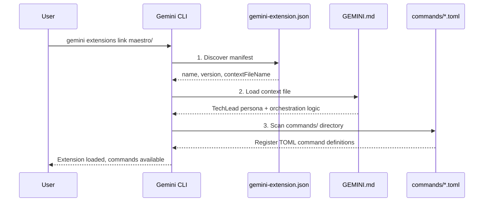
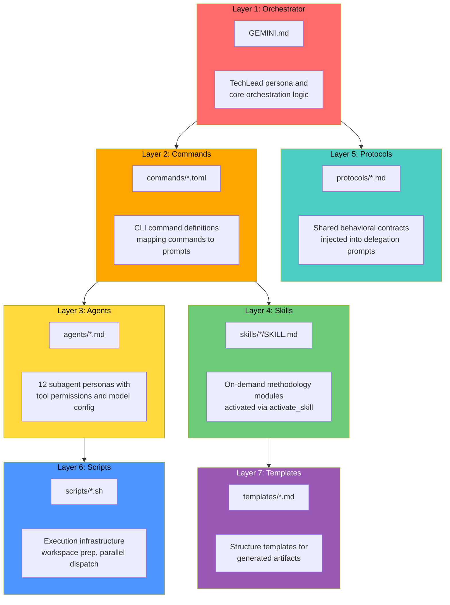
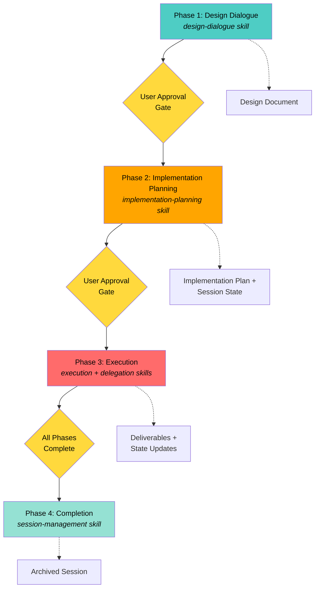
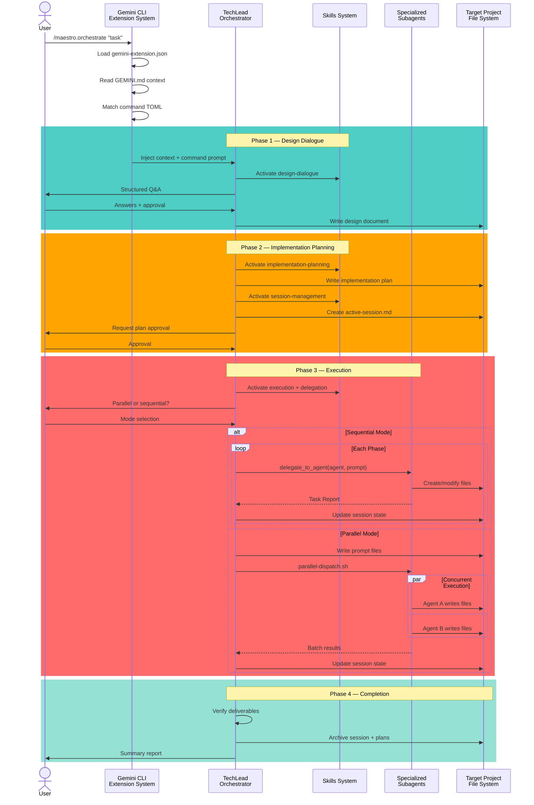
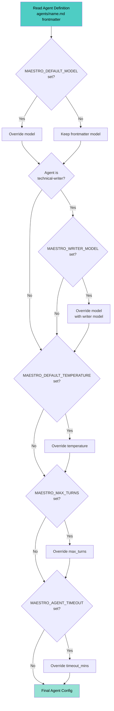

# System Overview

## Project Purpose

Maestro is a multi-agent orchestration extension for Gemini CLI that transforms a single AI assistant into a coordinated team of 12 specialized subagents. It addresses the fundamental challenge of complex software engineering tasks that require diverse expertise across architecture, implementation, testing, security, performance, and documentation.

Traditional single-agent AI assistants struggle with complex engineering projects because they must context-switch between vastly different roles and maintain coherence across all domains simultaneously. Maestro solves this by delegating work to specialized agents, each with focused expertise, constrained tool access, and optimized model configuration.

Maestro provides structured workflows for full-lifecycle development tasks while also offering standalone commands for focused activities like code review, debugging, security auditing, and performance analysis. All orchestration state persists in human-readable YAML and Markdown files, enabling reliable session resumption and transparent progress tracking.

## Configuration-Only Architecture

Maestro is a pure configuration project with no compiled code, no runtime dependencies, and no build step. The entire extension is defined through declarative configuration files:

### Why Configuration-Only

1. **Zero Build Overhead**: No compilation, bundling, or transpilation required. Installation is instant.
2. **Maximum Transparency**: All behavior is defined in human-readable text files that can be inspected, modified, and version-controlled.
3. **Direct Testability**: Changes to prompts, agent definitions, or workflows are immediately active after linking the extension.
4. **Minimal Dependencies**: No package.json dependencies. Only requires Gemini CLI with experimental subagent support.
5. **Declarative Clarity**: Separates orchestration logic (Markdown), command definitions (TOML), agent personas (Markdown + YAML), and templates (Markdown).

### How It Works

The Gemini CLI extension system loads configuration through a manifest file that points to context files and command definitions. When a user invokes a Maestro command, the CLI:

1. Reads `gemini-extension.json` to locate the context file (`GEMINI.md`)
2. Loads the TechLead persona defined in `GEMINI.md` as the active assistant context
3. Matches the user's command against TOML files in `commands/`
4. Injects the command's prompt template and any referenced skill files
5. Executes the orchestrator logic, which may activate additional skills or delegate to subagents

No code execution occurs at extension load time. Everything runs through the Gemini CLI's prompt processing and tool invocation system.

## Extension Loading Mechanism

### Bootstrap Sequence



The extension entry point is `gemini-extension.json` in the project root:

```json
{
  "name": "maestro",
  "version": "1.1.1",
  "description": "Multi-agent development orchestration platform — 12 specialists, 4-phase orchestration, parallel dispatch, persistent sessions, and standalone review/debug/security/perf commands",
  "contextFileName": "GEMINI.md"
}
```

When Gemini CLI loads the Maestro extension:

1. **Manifest Discovery**: The CLI scans the extension directory for `gemini-extension.json`
2. **Context File Loading**: The `contextFileName` field points to `GEMINI.md`, which becomes the orchestrator's system prompt
3. **Command Registration**: The CLI scans `commands/` for TOML files and registers each as a callable command
4. **Persona Activation**: The YAML frontmatter in `GEMINI.md` defines the TechLead orchestrator persona with model, description, and configuration

### GEMINI.md as System Prompt

The `GEMINI.md` file serves as the root context for all Maestro operations. It defines:

- **Orchestrator Identity**: The TechLead role and responsibilities
- **Four-Phase Workflow**: Design, Plan, Execute, Complete lifecycle
- **Startup Checks**: Prerequisite validation, settings resolution, workspace preparation
- **Execution Modes**: Parallel vs sequential delegation logic
- **Skills Reference**: Catalog of on-demand methodology modules
- **Agent Roster**: Overview of 12 specialized subagents

This file is injected as the base context for the TechLead orchestrator. Every command invocation receives this context first, ensuring consistent orchestration behavior.

### Command Loading

Each TOML file in `commands/` defines a Gemini CLI command with structure:

```toml
description = "Human-readable description"
prompt = """Template string with {{args}} substitution"""
```

When a user types `/maestro.orchestrate "task description"`, the CLI:

1. Locates `commands/maestro.orchestrate.toml`
2. Substitutes `{{args}}` with the user's task description
3. Injects the templated prompt into the TechLead context
4. Executes the TechLead orchestrator with the combined context

Commands can reference skills via activation directives in their prompt templates (e.g., `Activate the design-dialogue skill to guide the conversation.`), causing those skill files to be injected into the context dynamically.

## Seven-Layer Component Model

Maestro's architecture consists of seven distinct configuration layers, each with a specific purpose and data format.



### Layer 1: Orchestrator

**Directory**: Root (`GEMINI.md`)
**Format**: Markdown with YAML frontmatter
**Purpose**: Defines the TechLead orchestrator persona and core orchestration logic

The orchestrator layer provides:

- **Phase Transition Logic**: Rules for moving between Design, Plan, Execute, and Complete phases
- **Settings Resolution**: Environment variable parsing and default value application
- **Delegation Rules**: When to use sequential `delegate_to_agent` vs parallel `parallel-dispatch.sh`
- **Error Handling**: Retry logic, escalation protocols, session recovery
- **Content Writing Protocol**: Rules for using `write_file` vs shell commands

The TechLead orchestrator never writes code directly. It designs, plans, delegates, and verifies. All implementation work is performed by subagents.

### Layer 2: Commands

**Directory**: `commands/`
**Format**: TOML
**Purpose**: Maps CLI commands to prompts with skill/file injection

Each command file defines:

- **Description**: Human-readable summary shown in help text
- **Prompt Template**: The instruction given to the TechLead when the command is invoked
- **Skill Activation**: References to skills that should be loaded for this command
- **Argument Substitution**: Placeholders for user-provided arguments

Commands are the user-facing interface. They trigger workflows by injecting specialized prompts into the orchestrator context.

Example command structure (`maestro.orchestrate.toml`):

```toml
description = "Start a full Maestro orchestration for a complex engineering task"
prompt = """Activate Maestro orchestration mode for the following task:
<user-request>{{args}}</user-request>
Follow the Maestro orchestration protocol...
Activate the design-dialogue skill to guide the conversation."""
```

### Layer 3: Agents

**Directory**: `agents/`
**Format**: Markdown with YAML frontmatter
**Purpose**: Defines 12 specialized subagent personas with tool permissions and model configuration

Each agent file specifies:

- **Name**: Unique identifier used in delegation prompts
- **Description**: Role summary and domain expertise
- **Model**: Which Gemini model variant to use (pro vs flash)
- **Temperature**: Creativity parameter (0.0-1.0, typically 0.2 for consistency)
- **Max Turns**: Maximum conversation turns before timeout
- **Timeout**: Maximum execution time in minutes
- **Tools**: Specific tool permissions (read, write, shell, etc.)

Agent definitions are read by the orchestrator when constructing delegation prompts. The frontmatter provides machine-readable configuration, while the Markdown body contains the agent's persona and methodology.

### Layer 4: Skills

**Directory**: `skills/`
**Format**: Markdown with YAML frontmatter (`SKILL.md` per subdirectory)
**Purpose**: Reusable methodology modules activated on demand

Skills encapsulate detailed protocols that would bloat the base context if always loaded. They are injected only when needed:

- **design-dialogue**: Requirements gathering, architectural approach presentation, design convergence
- **implementation-planning**: Phase decomposition, agent assignment, dependency analysis, parallelization identification
- **execution**: Phase execution protocols, error handling, completion workflows, parallel vs sequential dispatch
- **delegation**: Subagent prompt construction, scope boundaries, settings overrides, file ownership rules
- **session-management**: Session creation, state updates, resume protocol, archival
- **code-review**: Scope detection, severity classification, structured review output
- **validation**: Build/lint/test pipeline detection, project type inference, result interpretation

Skills keep the orchestrator context lean by providing just-in-time methodology. They are activated via explicit directives in command prompts or orchestrator logic.

### Layer 5: Protocols

**Directory**: `protocols/`
**Format**: Markdown
**Purpose**: Shared behavioral contracts injected into delegation prompts

Protocols define cross-cutting concerns that apply to multiple agents:

- **agent-base-protocol.md**: Universal rules for all subagents (scope boundaries, completion criteria, error escalation)
- **filesystem-safety-protocol.md**: File operation safeguards (backup before overwrite, atomic writes, path validation)

When the orchestrator constructs a delegation prompt, it injects relevant protocol files to ensure consistent behavior across all subagents. Protocols are embedded in delegation prompts via file concatenation.

### Layer 6: Scripts

**Directory**: `scripts/`
**Format**: Shell (Bash)
**Purpose**: Execution infrastructure for workspace preparation and parallel dispatch

Scripts provide operational utilities:

- **ensure-workspace.sh**: Creates `.gemini/` directory structure, validates state directory configuration
- **parallel-dispatch.sh**: Spawns concurrent Gemini CLI processes for independent phases, collects results
- **read-state.sh**: Reads session state YAML frontmatter for resumption
- **write-state.sh**: Updates session state atomically
- **validate-agent-permissions.sh**: Checks agent tool permissions against required tools for a task
- **sync-version.js**: Synchronizes version from `package.json` to `gemini-extension.json` during releases
- **test-parallel-dispatch.sh**: Proof-of-concept test for parallel dispatch functionality

These scripts bridge the gap between declarative configuration and runtime execution. They handle system-level operations that cannot be expressed purely in prompts.

### Layer 7: Templates

**Directory**: `templates/`
**Format**: Markdown with YAML frontmatter
**Purpose**: Structure templates for generated artifacts

Templates define the canonical structure for orchestration outputs:

- **design-document.md**: Problem statement, requirements, approach, architecture, agent team, risks, success criteria
- **implementation-plan.md**: Dependency graph, execution strategy, per-phase specifications, file inventory, risk classification
- **session-state.md**: Session metadata, phase status tracking, file manifest, token usage, error logs

The orchestrator reads these templates to guide document generation. They ensure consistent structure across all Maestro-generated documentation.

## Four-Phase Workflow

Maestro orchestrates complex engineering tasks through a structured lifecycle with explicit gates and error handling.



### Phase 1: Design Dialogue

**Purpose**: Converge on an approved architectural design through structured requirements gathering

**Activation**: `/maestro.orchestrate` command triggers the `design-dialogue` skill

**Process**:

1. **Question Framework**: The orchestrator asks one question at a time, preferring multiple-choice format with 2-4 options
2. **Coverage Areas**: Systematically explores problem scope, technical constraints, technology preferences, quality requirements, and deployment context
3. **Approach Presentation**: After gathering requirements, presents 2-3 architectural approaches with pros/cons/best-when analysis
4. **Design Convergence**: Builds the design document section-by-section, validating each with the user before proceeding
5. **Document Generation**: Writes approved design to `.gemini/plans/YYYY-MM-DD-<topic>-design.md`

**Output**: Approved design document with problem statement, requirements, selected approach, architecture, agent team composition, risk assessment, and success criteria

**Gate**: User must explicitly approve the complete design document before Phase 2 begins

### Phase 2: Implementation Planning

**Purpose**: Decompose the design into executable phases with agent assignments and dependency mapping

**Activation**: Automatic after Phase 1 approval, activates `implementation-planning` skill

**Process**:

1. **Input Analysis**: Analyzes approved design for components, interfaces, data models, dependencies, and technology stack
2. **Phase Decomposition**: Breaks implementation into phases following foundation-first, single-responsibility, agent-alignment principles
3. **Agent Assignment**: Maps each phase to 1-2 specialized agents based on task domain and tool requirements
4. **Parallelization Identification**: Identifies phases that can run concurrently (no shared files, same dependency depth)
5. **Cost Estimation**: Calculates per-phase token consumption and cost based on model, files, and retry budget
6. **Plan Generation**: Writes detailed plan to `.gemini/plans/YYYY-MM-DD-<topic>-impl-plan.md`
7. **Session Creation**: Invokes `session-management` skill to create `.gemini/state/active-session.md`

**Output**: Approved implementation plan with dependency graph, execution strategy, per-phase specifications, file inventory, risk classification, and cost estimate

**Gate**: User must explicitly approve the complete implementation plan before Phase 3 begins

### Phase 3: Execution

**Purpose**: Execute implementation phases by delegating to specialized subagents

**Activation**: Automatic after Phase 2 approval, activates `execution` and `delegation` skills

**Process**:

1. **Mode Selection**: Prompts user to choose parallel or sequential execution (unless `MAESTRO_EXECUTION_MODE` is pre-set)
2. **Phase Iteration**: Processes phases according to dependency graph
3. **Delegation**:
   - **Sequential Mode**: Uses `delegate_to_agent` tool for one-at-a-time execution with standard approval flow
   - **Parallel Mode**: Writes prompts to dispatch directory, invokes `parallel-dispatch.sh` to spawn concurrent processes
4. **State Updates**: After each phase completes, updates session state with file manifest, status, and errors
5. **Error Handling**: Retries failed phases up to `MAESTRO_MAX_RETRIES` times before escalating to user
6. **Validation**: Runs build/lint/test commands per phase validation criteria

**Output**: All deliverables specified in the implementation plan, tracked in session state

**Gate**: All phases must reach `completed` or `skipped` status before Phase 4 begins

### Phase 4: Completion

**Purpose**: Verify deliverables, finalize session, archive state

**Activation**: Automatic after all Phase 3 phases complete

**Process**:

1. **Deliverable Review**: Confirms all files in the plan's file inventory were created/modified
2. **Final Validation**: Runs full build/lint/test suite if defined
3. **Session Finalization**: Marks session state as `completed`
4. **Archival**: Moves design document, implementation plan, and session state to `archive/` subdirectories
5. **Summary Presentation**: Provides user with file count, token usage, next steps

**Output**: Archived session with complete audit trail

**Gate**: None (terminal phase)

### Phase Transition Rules

- **Forward Only**: Phases execute in strict order: 1 → 2 → 3 → 4
- **Explicit Approval**: User must approve before advancing from Phase 1 to 2, and from Phase 2 to 3
- **Automatic Advance**: Phase 3 to 4 transition is automatic upon completion
- **Error Escalation**: If a phase fails after `MAESTRO_MAX_RETRIES` attempts, execution pauses and user is asked for guidance
- **Resume Protocol**: `/maestro.resume` command can restart execution at the last failed or pending phase

### Error Handling

**Retry Logic**:

1. Phase execution fails (non-zero exit, validation failure, or agent error)
2. Orchestrator checks retry count against `MAESTRO_MAX_RETRIES` (default: 2)
3. If retries remain, re-executes phase with same prompt
4. If retries exhausted, escalates to user with error details

**User Escalation**:

When retries are exhausted, the orchestrator:

1. Presents the error logs from all retry attempts
2. Shows the phase specification and delegation prompt
3. Asks the user to choose: skip phase, modify prompt and retry, or abort session

**Session Recovery**:

If execution is interrupted (timeout, crash, manual abort):

1. Session state persists in `.gemini/state/active-session.md` with phase statuses
2. User invokes `/maestro.resume` to restart
3. Orchestrator presents session summary with completed/pending/failed phases
4. Execution resumes from first pending or failed phase

## Component Interaction Flow



### Data Flow Details

1. **User Command**: User types `/maestro.orchestrate "Build a REST API"`
2. **Extension System**: Gemini CLI loads `gemini-extension.json`, reads `GEMINI.md` as context, finds `commands/maestro.orchestrate.toml`, injects prompt template
3. **Orchestrator Activation**: TechLead persona receives combined context and begins Phase 1
4. **Skill Activation**: Orchestrator activates `design-dialogue` skill, which injects detailed methodology
5. **Design Phase**: Orchestrator asks structured questions, presents approaches, validates sections, writes design document
6. **Planning Phase**: Activates `implementation-planning` skill, generates plan, creates session state
7. **Execution Phase**: Activates `execution` and `delegation` skills, prompts for mode selection
8. **Sequential Delegation**: If sequential, uses `delegate_to_agent` tool, which loads agent definition, injects protocols, executes agent, returns result
9. **Parallel Delegation**: If parallel, writes prompts to dispatch directory, invokes `parallel-dispatch.sh`, script spawns concurrent `gemini` processes, collects results
10. **State Updates**: After each phase, orchestrator updates `active-session.md` with file manifest and status
11. **Completion**: Final validation, archival to `archive/` subdirectories, summary presentation

### Settings Override Flow



When constructing delegation prompts, the orchestrator applies settings in this order:

1. **Agent Base Definition**: Read `agents/<name>.md` frontmatter for default model, temperature, max_turns, timeout
2. **Default Model Override**: If `MAESTRO_DEFAULT_MODEL` is set, override `model` field
3. **Writer Model Override**: If agent is `technical-writer` and `MAESTRO_WRITER_MODEL` is set, override `model` field
4. **Temperature Override**: If `MAESTRO_DEFAULT_TEMPERATURE` is set, override `temperature` field
5. **Max Turns Override**: If `MAESTRO_MAX_TURNS` is set, override `max_turns` field
6. **Timeout Override**: If `MAESTRO_AGENT_TIMEOUT` is set, override `timeout_mins` field

Agent-specific overrides always take precedence over defaults.

### Parallel Execution Data Flow

Parallel dispatch bypasses the sequential `delegate_to_agent` tool scheduler:

1. **Prompt Generation**: Orchestrator constructs complete delegation prompts for each agent in the batch
2. **File Writing**: Prompts written to `.gemini/parallel/<batch-id>/prompts/<agent-name>.txt`
3. **Script Invocation**: Orchestrator calls `./scripts/parallel-dispatch.sh <dispatch-dir>` via `run_shell_command`
4. **Process Spawning**: Script reads all `.txt` files from `prompts/`, spawns one `gemini -p <file> --yolo --output-format json` process per file
5. **Concurrent Execution**: All processes run simultaneously (subject to `MAESTRO_MAX_CONCURRENT` cap)
6. **Result Collection**: Script waits for all processes, writes results to `.gemini/parallel/<batch-id>/results/`:
   - `<agent>.json`: Structured JSON output
   - `<agent>.exit`: Exit code (0=success, 124=timeout, other=error)
   - `<agent>.log`: stderr/debug output
   - `summary.json`: Batch summary with per-agent status
7. **Result Reading**: Orchestrator reads `summary.json` and individual result files
8. **State Update**: Orchestrator updates session state with file manifests, statuses, and errors from all agents in the batch

Parallel agents cannot communicate with each other during execution. Each prompt must be self-contained.

## State Management

### Session State Structure

All orchestration progress persists in `.gemini/state/active-session.md` with YAML frontmatter and Markdown body:

**Frontmatter** (machine-readable):

- `session_id`: Unique identifier
- `task`: User's original task description
- `design_doc`: Path to design document
- `impl_plan`: Path to implementation plan
- `current_phase`: Current phase number (1-4)
- `execution_mode`: `parallel` or `sequential`
- `phases`: Array of phase objects with `id`, `name`, `agent`, `status`, `files_created`, `files_modified`, `retry_count`, `errors`
- `token_usage`: Per-agent, per-phase token consumption
- `created`: ISO 8601 timestamp
- `updated`: ISO 8601 timestamp

**Body** (human-readable):

- Chronological log of major events (phase starts, completions, errors, user interventions)

### State Transitions

Each phase has a lifecycle:

1. **pending**: Defined in plan but not yet started
2. **in_progress**: Currently executing
3. **completed**: Finished successfully with validation passing
4. **failed**: Exhausted retries without success
5. **skipped**: User chose to skip after failure

### Session Lifecycle

1. **Creation**: `session-management` skill writes initial `active-session.md` during Phase 2
2. **Updates**: After each phase execution, orchestrator updates status, file manifest, token usage
3. **Persistence**: All updates are atomic writes (read-modify-write)
4. **Resumption**: `/maestro.resume` reads `active-session.md`, parses phase statuses, continues from first pending/failed
5. **Archival**: `/maestro.archive` or automatic Phase 4 completion moves `active-session.md` to `archive/` with timestamp

### File Manifest Tracking

The orchestrator maintains a complete audit trail of file operations:

- **files_created**: Array of paths created during the phase
- **files_modified**: Array of paths modified during the phase
- **files_deleted**: Array of paths deleted during the phase

This enables:

- Conflict detection (parallel phases modifying same files)
- Rollback planning (which files to restore on failure)
- Deliverable verification (all planned files were actually created)
- Documentation generation (changelog of what changed)

### Token Usage Tracking

Per-phase token metrics:

- `input_tokens`: Tokens consumed reading context and files
- `output_tokens`: Tokens generated by the agent
- `total_tokens`: Sum of input + output
- `estimated_cost`: Dollar amount based on model pricing

Session-level aggregation:

- `total_input_tokens`: Sum across all phases
- `total_output_tokens`: Sum across all phases
- `total_cost`: Sum of per-phase costs

This enables cost transparency and budget tracking for complex orchestrations.

## Agent Tool Access Model

Maestro enforces least-privilege tool access based on agent role:

### Read-Only Agents

**Agents**: architect, api-designer, code-reviewer

**Tools**: `read_file`, `glob`, `search_file_content`; architect additionally has `google_web_search`

**Rationale**: These agents perform analysis and produce recommendations. They should not modify code or execute commands. Read-only access prevents accidental changes and enforces their advisory role.

**Use Cases**:

- architect: Reviews codebase structure, proposes system designs
- api-designer: Analyzes existing APIs, designs new endpoints
- code-reviewer: Reviews code quality, identifies issues

### Read + Shell Agents

**Agents**: debugger, performance-engineer, security-engineer

**Tools**: `read_file`, `glob`, `search_file_content`, `run_shell_command`

**Rationale**: Investigation tasks require running diagnostics, profiling, scanning, or debugging tools without modifying source files.

**Use Cases**:

- debugger: Runs reproducers, checks logs, traces execution
- performance-engineer: Profiles code, benchmarks, analyzes metrics
- security-engineer: Runs vulnerability scanners, audits dependencies

### Read + Write Agents

**Agents**: refactor, technical-writer

**Tools**: `read_file`, `glob`, `search_file_content`, `write_file`, `replace`

**Rationale**: Code and documentation modifications that do not require shell execution (no builds, no tests, no deploys).

**Use Cases**:

- refactor: Restructures code, applies design patterns, modernizes
- technical-writer: Creates/updates documentation, API docs, READMEs

### Full Access Agents

**Agents**: coder, data-engineer, devops-engineer, tester

**Tools**: `read_file`, `glob`, `search_file_content`, `write_file`, `replace`, `run_shell_command`

**Rationale**: Complete implementation tasks that require writing code, running builds, executing tests, and deploying infrastructure.

**Use Cases**:

- coder: Implements features, writes tests, runs builds
- data-engineer: Creates schemas, writes migrations, runs queries
- devops-engineer: Configures CI/CD, writes Dockerfiles, deploys
- tester: Writes test suites, runs tests, analyzes coverage

### Tool Enforcement

Tool permissions are defined in agent frontmatter and enforced by the Gemini CLI subagent system. When the orchestrator delegates to an agent, the tool list is passed to the `delegate_to_agent` call. Attempts to use restricted tools result in errors that are logged in session state.

## Model Configuration

Maestro uses Gemini 3 preview models for strong reasoning with Gemini 2.5 as fallback:

### Default Model Assignment

- **Primary**: `gemini-3-pro-preview` for all agents requiring strong reasoning (11/12 agents)
- **Cost-Optimized**: `gemini-3-flash-preview` for technical-writer (documentation generation)
- **Fallback**: `gemini-2.5-pro` when Gemini 3 models are unavailable

### Model Override Mechanism

Users can override models via environment variables:

- `MAESTRO_DEFAULT_MODEL`: Changes primary model for all agents
- `MAESTRO_WRITER_MODEL`: Changes model specifically for technical-writer

Example configuration:

```bash
export MAESTRO_DEFAULT_MODEL="gemini-2.5-pro"
export MAESTRO_WRITER_MODEL="gemini-3-flash-preview"
```

This switches all agents to Gemini 2.5 Pro except the writer, which stays on Flash for cost optimization.

### Temperature Configuration

All agents use `temperature: 0.2` by default for consistency and determinism. This can be overridden globally via `MAESTRO_DEFAULT_TEMPERATURE` or per-agent in frontmatter.

Lower temperature reduces randomness and produces more consistent output across retries. Higher temperature increases creativity but may reduce reliability for code generation tasks.

### Token Limits and Timeouts

Agent configuration includes execution bounds:

- `max_turns`: Maximum conversation turns (default: 25)
- `timeout_mins`: Maximum execution time (default: 10 minutes)

These prevent runaway execution and enforce efficient agent behavior. If an agent exceeds limits, it is terminated and the phase is marked as failed.

## Configuration Environment Variables

Maestro provides 13 environment variables for runtime customization:

| Variable | Default | Type | Purpose |
|----------|---------|------|---------|
| `MAESTRO_DEFAULT_MODEL` | `gemini-3-pro-preview` | string | Primary model for all agents |
| `MAESTRO_WRITER_MODEL` | `gemini-3-flash-preview` | string | Model for technical-writer |
| `MAESTRO_DEFAULT_TEMPERATURE` | `0.2` | float | Creativity parameter (0.0-1.0) |
| `MAESTRO_MAX_TURNS` | `25` | integer | Max conversation turns per agent |
| `MAESTRO_AGENT_TIMEOUT` | `10` | integer | Timeout in minutes per agent |
| `MAESTRO_DISABLED_AGENTS` | _(none)_ | string | Comma-separated agent names to exclude |
| `MAESTRO_MAX_RETRIES` | `2` | integer | Retry attempts per phase before escalation |
| `MAESTRO_AUTO_ARCHIVE` | `true` | boolean | Archive sessions on completion |
| `MAESTRO_VALIDATION_STRICTNESS` | `normal` | enum | `strict` / `normal` / `lenient` |
| `MAESTRO_STATE_DIR` | `.gemini` | string | Base directory for state and plans |
| `MAESTRO_MAX_CONCURRENT` | `0` | integer | Max simultaneous parallel agents (0=unlimited) |
| `MAESTRO_STAGGER_DELAY` | `5` | integer | Seconds between parallel agent launches |
| `MAESTRO_EXECUTION_MODE` | `ask` | enum | `parallel` / `sequential` / `ask` |

### Configuration Resolution

The orchestrator resolves configuration at startup:

1. Reads all `MAESTRO_*` environment variables
2. Applies defaults for any unset variables
3. Logs non-default settings for transparency
4. Uses resolved values when constructing delegation prompts and invoking scripts

### Disabled Agents

The `MAESTRO_DISABLED_AGENTS` variable excludes agents from planning:

```bash
export MAESTRO_DISABLED_AGENTS="architect,api-designer"
```

When generating implementation plans, the orchestrator skips disabled agents. If a disabled agent is the only specialist for a required domain, the orchestrator warns the user and suggests alternatives.

### State Directory Customization

The `MAESTRO_STATE_DIR` variable relocates session state:

```bash
export MAESTRO_STATE_DIR=".maestro-state"
```

All paths are adjusted:

- Session state: `<state_dir>/state/active-session.md`
- Plans: `<state_dir>/plans/`
- Archives: `<state_dir>/state/archive/` and `<state_dir>/plans/archive/`

This enables project-specific customization or integration with existing directory conventions.

## Validation and Testing

Maestro has no build step, no linting, and no automated test suite. Validation is entirely manual through Gemini CLI.

### Manual Testing Workflow

1. **Link Extension**: `gemini extensions link maestro/`
2. **Restart Gemini CLI**: Close and reopen the Gemini CLI terminal session to reload extension changes
3. **Verify Commands**: Type `/maestro.` and verify autocomplete shows all commands
4. **Test Orchestration**: Run `/maestro.orchestrate "simple task"` and verify all four phases execute
5. **Test Standalone Commands**: Run `/maestro.review`, `/maestro.debug`, etc. to verify direct delegation
6. **Verify State Persistence**: Check `.gemini/state/active-session.md` contains expected YAML and logs
7. **Test Resume**: Interrupt execution, run `/maestro.resume`, verify continuation from correct phase

### Validation Criteria

Changes are considered valid when:

- All commands execute without parsing errors
- Skills activate correctly when referenced
- Agent delegation prompts contain expected persona and tools
- Session state files are written with valid YAML frontmatter
- Parallel dispatch spawns correct number of processes and collects results
- Error handling triggers retries and escalation as expected

### Troubleshooting Common Issues

Common issues and resolutions:

- **Command not found**: Verify TOML file exists in `commands/` with correct filename
- **Skill not loading**: Check `SKILL.md` exists in skill subdirectory with valid frontmatter
- **Agent delegation fails**: Verify agent definition has valid tools list and model name
- **State file corrupt**: Check YAML syntax in frontmatter, ensure no unescaped characters
- **Parallel dispatch timeout**: Increase `MAESTRO_AGENT_TIMEOUT` or reduce batch size

### CI/CD Pipeline

The `.github/workflows/release.yml` workflow triggers on `v*` tag push:

1. Extracts changelog section for the version
2. Creates a GitHub Release with the tag and changelog
3. No build, test, or publish steps (configuration-only project)

Releases are purely for versioning and distribution. No artifacts are compiled or uploaded.

## Extension Points

Maestro's declarative architecture enables several customization points:

### Adding New Agents

1. Create `agents/<name>.md` with YAML frontmatter defining tools, model, timeout
2. Write agent persona and methodology in Markdown body
3. Update `GEMINI.md` agent roster table
4. Add agent to implementation-planning skill's assignment criteria

No code changes required. The orchestrator dynamically reads agent definitions when constructing delegation prompts.

### Adding New Skills

1. Create `skills/<name>/SKILL.md` with YAML frontmatter defining skill metadata
2. Write detailed methodology in Markdown body
3. Reference skill in command prompts via activation directive

Skills are loaded on demand, keeping base context lean.

### Adding New Commands

1. Create `commands/maestro.<name>.toml` with description and prompt template
2. Reference skills or inject files as needed in prompt
3. Restart Gemini CLI to register new command

No extension manifest changes required. The CLI scans `commands/` on startup.

### Customizing Templates

1. Edit `templates/<name>.md` to change structure
2. Update corresponding skill to reference new sections
3. Restart Gemini CLI for changes to take effect

Templates guide document generation but do not enforce strict validation. The orchestrator adapts to template changes.

### Modifying Workflows

1. Edit `GEMINI.md` to change phase transition logic
2. Update skill files to modify phase methodologies
3. Restart Gemini CLI to reload context

All orchestration logic lives in readable text files. No compilation or transpilation required.
